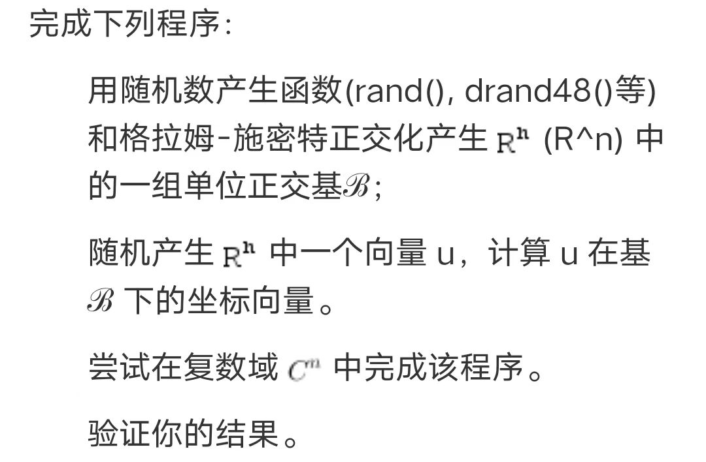

# Question

# 理论
## 格拉姆施密特正交化

&emsp;&emsp;这是线性代数中常用的一种方法。对于$R^{n}$中的n个线性无关的向量：$\textbf{u}_{1},\textbf{u}_{2},...,\textbf{u}_{n}$。可以任意选取其中一个向量作为一个基，那么怎样才能得到与之正交的剩下n-1个基呢？可以再取一个向量，将其分解为延第一个向量方向和与与其正交方向的两个向量，取正交的那个作为第二个基。这样是可行的，因为它们俩线性无关。那么接下来呢？再取一个向量，可以用反证法证明它与前面的两个基是线性无关的，所以我们将其延前两个基的方向分解还会得到一个与前两个基均正交的向量，将其作为第三个基。依次类推，我们可以得到$R^{n}$的一组正交基，将其归一化就可以得到正交归一基。用数学语言可以表示为：

$$
\textbf{e}_{1} = \textbf{u}_{1}/|\textbf{u}_{1}| \\
\textbf{e}_{2} = (\textbf{u}_{2}-\frac{<\textbf{u}_{1}^\top ,\textbf{u}_{2}>}{<\textbf{u}_{1}^\top ,\textbf{u}_{1}>}\textbf{u}_{1})/|\textbf{u}_{2}-\frac{<\textbf{u}_{1}^\top ,\textbf{u}_{2}>}{<\textbf{u}_{1}^\top ,\textbf{u}_{1}>}\textbf{u}_{1}| \\
...
$$

&emsp;&emsp;上面只是公式的表示形式，在数值计算的过程中，先求出基再归一化会比较方便。

## 复空域上的推广

&emsp;&emsp;复数域与实数域上的向量的不同点是元素是复数还是实数。如果我们不加改变就将上面的公式代入复数域的话，那我们就遇到大麻烦了！

&emsp;&emsp;问题在于内积的定义上面，复数域上的内积并不是实数域上那样对应元素的乘积和。这样定义的内积在复数域上很不好。所以怎么办呢？只能换一种内积的定义方式。

&emsp;&emsp;我们考虑一下实数域上内积的性质，其中一条是向量与其自身的内积代表向量的长度，在复数域中，长度则用复共轭表示。复数长度在目前至少是没有定义的。所以可以将复数域中的内积定义为复共轭。如下：

$$
<\textbf{a} ,\textbf{b}> = \textbf{a}^\dag \textbf{b} 或 <\textbf{a} ,\textbf{b}> = \textbf{a}^\top \textbf{b}^{*}
$$

&emsp;&emsp;实际上用的是前者，但它们除了形式上不一样外，没有什么本质的不同。而且第一种更加对称和简洁。

&emsp;&emsp;还可以看出，这样的定义对于实数域同样适用。

## 坐标向量

&emsp;&emsp;这个比较好整,记$\textbf{u}$在$\mathfrak{B}$中的坐标向量为:
$$
\textbf{u}=[u_{1}\space u_{2}\space ... u_{n}]^\top
$$
&emsp;&emsp;则：
$$
u_{1} = <\textbf{u}, \textbf{e}_{1}> \\
u_{2} = <\textbf{u}, \textbf{e}_{2}> \\
...\\
u_{n} = <\textbf{u}, \textbf{e}_{n}> \\
$$

# 编程思路
## 复数的表达
&emsp;&emsp;首先，可以很容易得到下述结论：
>实数域仅仅是复数域中虚部为零的特殊情况。

&emsp;&emsp;这意味着我们只需要给出虚数的算法就可以了。我的打算是自己编写计算复数的程序，复数的表示就用结构体。将它们写入头文件，先写四则运算，以后再添加。

## 向量的生成
&emsp;&emsp;n个向量好生成，关键是线性无关怎么判断，以及如果线性相关了怎么修改。我能想到的最简单的方式是用行列式来判断。至于如果线性相关了该怎么办嘛，其实直接重新生成一组就好了。因为只要随机数生成器比较好的话，生成线性相关的向量的概率是很小的，有可能是零。

## 正交化
&emsp;&emsp;这个更简单，我们写个内积的函数就可以了，剩下的直接代公式。

这样，程序基本上就出来了。

