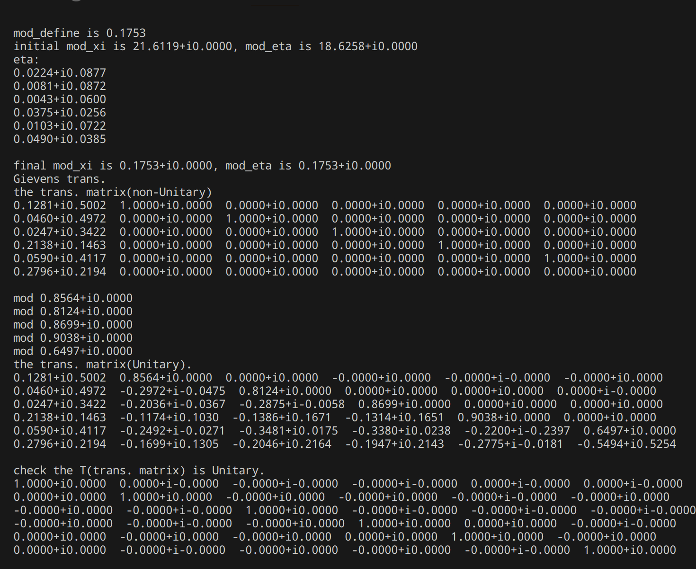
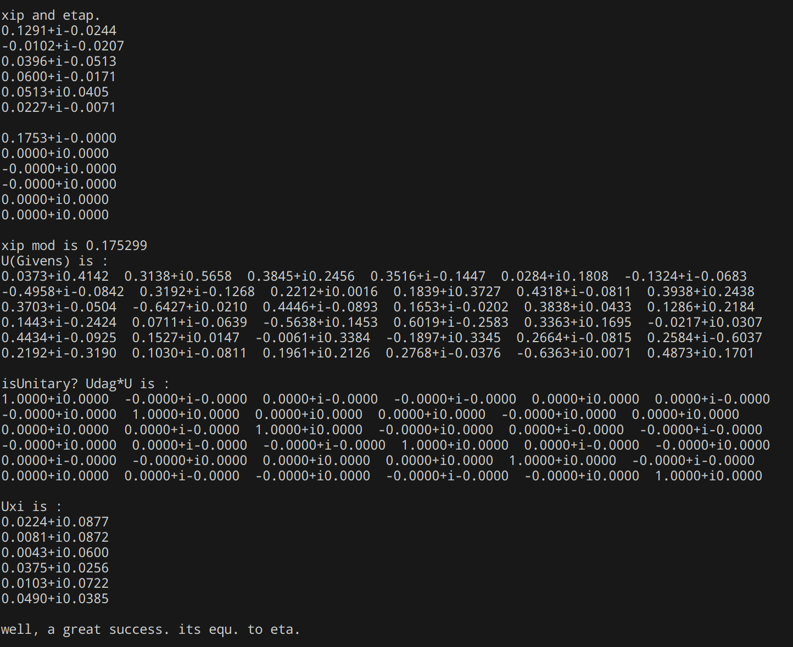
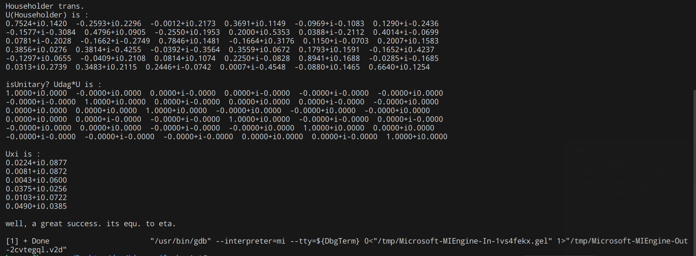
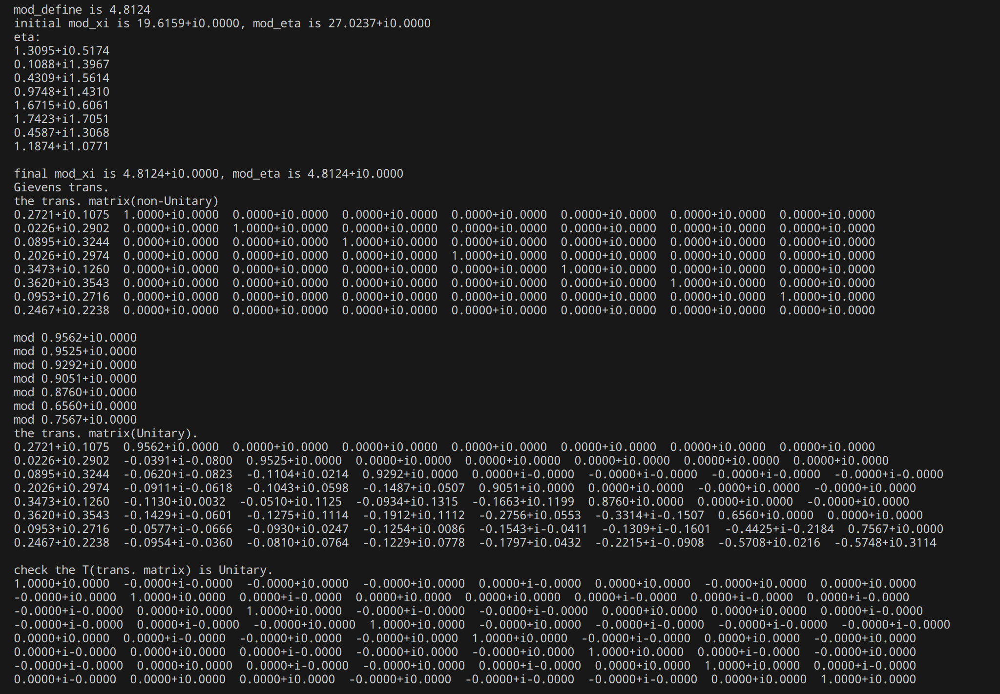
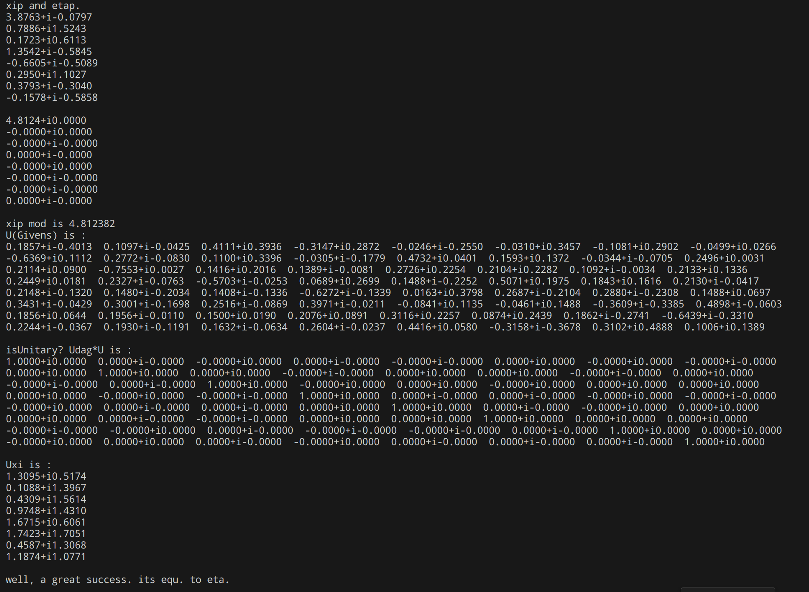
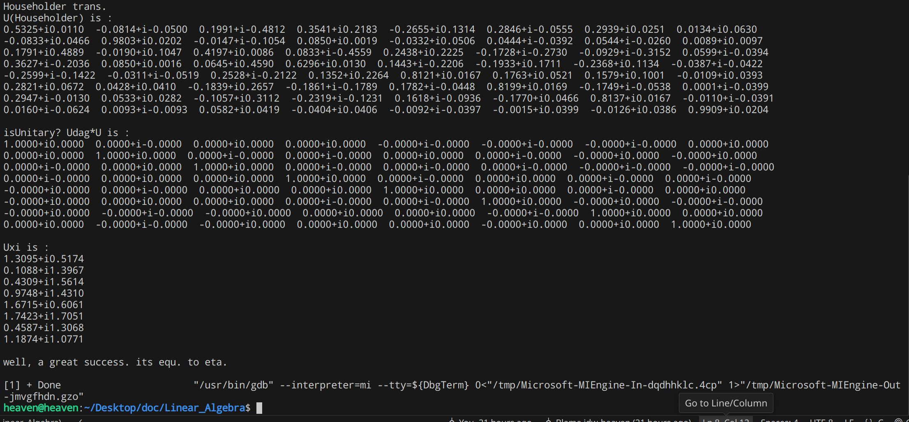
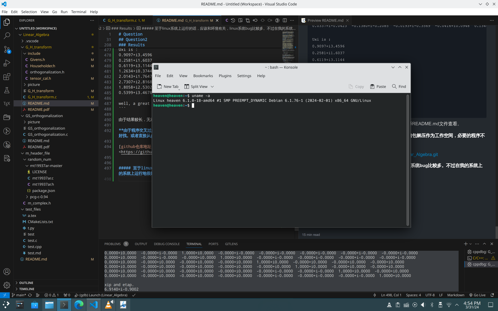

# Question
1. 分别用Givens和Householder变换写出幺正矩阵$U$使得$U\begin{bmatrix} 1 \\ 1 \end{bmatrix} = \begin{bmatrix} \sqrt{2}  \\ 0 \end{bmatrix}$，并将你得到的Givens矩阵写为Householder矩阵的乘积。
2. 编写程序：
   随机生成$\mathbb{C}^{n}$中非零向量$\boldsymbol{\xi }, \boldsymbol{\eta }$，要求$\Vert \boldsymbol{\xi }\Vert = \Vert \boldsymbol{\eta }\Vert $，分别用Givens变换和Householder变换计算幺正矩阵$U$,使$U\boldsymbol{\xi } = \boldsymbol{\eta }$。
   要求：
   - n 是函数参数,可以是任意正整数;
   - 非零向量$\boldsymbol{\xi }, \boldsymbol{\eta }$作为函数参数;
   - 确认矩阵$U$是幺正矩阵;
   - 用函数实现, 例如:
      ```C
      int Givens(int n, Complex* xi, Complex* yita, Complex* U)
        {
        }
      ```  
        这里Complex也可以写为complex\<double\>。
   - 随机产生3组n, $\boldsymbol{\xi }, \boldsymbol{\eta }$，调用函数计算相应的矩阵$U$，并验算你的结果。
   - 写文档详细介绍你的算法以及运行结果;
   - 如果取实数域中的向量,此题最多给9分;
   - 要求程序在linux下面可以运行;
   - 自作业发布之日起两周内交作业.

## Question1
##### Note:题目中要求的是幺正矩阵，但由于涉及到的向量均属于$\mathbb{R}^{2}$空间（$\mathbb{C}^{2}$的子空间），所以实际要求的是正交矩阵。（所有的正交矩阵都是幺正的） 
1. Givens矩阵
   Givens矩阵$U$可以表示为：$U = \begin{bmatrix} \cos \theta & \sin \theta \\ -\sin \theta & \cos \theta \end{bmatrix} $, 则$\begin{bmatrix} \cos \theta & \sin \theta \\ -\sin \theta & \cos \theta \end{bmatrix} \begin{bmatrix} 1 \\ 1 \end{bmatrix} = \begin{bmatrix} \cos \theta + \sin \theta \\ -\sin \theta + \cos \theta \end{bmatrix} = \begin{bmatrix} \sqrt{2} \\ 0 \end{bmatrix}$, 可以解得$\theta = \pi/4$.
   综上，Givens矩阵$U = \frac{\sqrt{2} }{2} \begin{bmatrix} 1& 1 \\ -1 & 1\end{bmatrix}$.
2. Householder矩阵
   记$\boldsymbol{a} = \begin{bmatrix} 1 \\ 1 \end{bmatrix}, \boldsymbol{b} = \begin{bmatrix} \sqrt{2} \\ 0 \end{bmatrix}$，则$\mathbf{H}  = \mathbf{I} - 2\boldsymbol{\omega }\boldsymbol{\omega ^{\intercal}}$, 其中$\boldsymbol{\omega } = \frac{\mathbf{{a}-\mathbf{b}}}{\Vert \mathbf{a}-\mathbf{b}\Vert}$.
   综上，Householder矩阵$U = \frac{\sqrt{2} }{2} \begin{bmatrix} 1& 1 \\ 1 & -1\end{bmatrix}$.

## Question2
### 理论基础
#### Givens 变换
- 引理：有$x = (\xi _{1}, \xi _{2}, ..., \xi _{n})^{\intercal} \in \mathbb{C} ^{n}$, 当$\vert \xi _{i}\vert^{2} + \vert \xi _{k}\vert^{2} \neq 0$时，令$c = \frac{\vert \xi_{i}\vert}{\sqrt{\vert \xi _{i}\vert^{2} + \vert \xi _{k}\vert^{2}}}, s = \frac{\vert \xi_{k}\vert}{\sqrt{\vert \xi _{i}\vert^{2} + \vert \xi _{k}\vert^{2}}}, \theta _{1} = -arg \xi _{i}, \theta _{2} = -arg \xi _{k}, \mathbf{y} = \mathbf{U_{ik}}\mathbf{x} = (\eta_{1}, \eta_{2}, ..., \eta_{n})^{\intercal}$, 其中$\left\{ \begin{aligned} \eta_{i} = \xi _{i}ce^{j\theta_{1}}+\xi_{k}se^{j\theta_{2}} \\ \eta_{k} = -\xi _{i}se^{-j\theta_{2}}+\xi_{k}ce^{-j\theta_{1}} \\ \eta_{t} = \xi_{t} (t \neq i,k) \end{aligned} \right.$，则有$\eta_{i} = \sqrt{\vert \xi _{i}\vert^{2} + \vert \xi _{k}\vert^{2}}\gt 0, \eta_{k} = 0$。
这个引理很好证明，直接带进去验算即可，这里就不展开去算了。

对于$\mathbb{C} ^{n}$中的向量$\boldsymbol{\xi}, \boldsymbol{\eta}$, 如果$\eta_{n} \neq 0$,那么我们可以得到线性无关集$\{\boldsymbol{\eta},\mathbf{e_{2}}, \mathbf{e_{3}}, ..., \mathbf{e_{n}}\}$。使用上一次作业中施密特正交化可以得到一个坐标变换矩阵$T = [\boldsymbol{\mu_{1}} \quad \boldsymbol{\mu_{2}} \quad ... \quad \boldsymbol{\mu_{n}}]$, 其中$\boldsymbol{\mu_{1}} = \boldsymbol{\eta}/\vert \boldsymbol{\eta}\vert$.

**非常重要的一点是$T$是幺正矩阵，即$T^{\dagger}T = TT^{\dagger} = I$**.

这样就有$\boldsymbol{\xi ^{\prime}} = T^{\dagger}\boldsymbol{\xi}, \boldsymbol{\eta ^{\prime}} = T^{\dagger}\boldsymbol{\eta} = (\vert \boldsymbol{\eta}\vert, 0, 0, ..., 0)^{\intercal}$，于是我们可以通过引理，进行最多n-1次（如果$\boldsymbol{\eta}$含有0分量的话，那一次就不用转了）的Givens旋转使$\boldsymbol{\xi ^{\prime}}$变成$\boldsymbol{\eta ^{\prime}}$。即$U^{\prime}\boldsymbol{\xi ^{\prime}} = \boldsymbol{\eta ^{\prime}}$.

通过坐标变换可以得到$TU^{\prime}T^{\dagger}T\boldsymbol{\xi ^{\prime}} = T\boldsymbol{\eta ^{\prime}}$, 即$TU^{\prime}T^{\dagger}\boldsymbol{\xi} = \boldsymbol{\eta}$;这样我们就得到了$U = TU^{\prime}T^{\dagger}$.

#### Householder 变换
非零向量$\boldsymbol{\xi}, \boldsymbol{\eta}$满足$\boldsymbol{\xi} \cdot  \boldsymbol{\xi} = \boldsymbol{\eta} \cdot \boldsymbol{\eta}$, 如果$\boldsymbol{\eta} = e^{i\theta}\boldsymbol{\xi}$, 令$U = e^{i\theta}I$, 则$U\boldsymbol{\xi} = \boldsymbol{\eta}$.

否则，令$\boldsymbol{\xi ^{\dagger}}\boldsymbol{\eta} = e^{i\theta}\vert\boldsymbol{\xi ^{\dagger}}\boldsymbol{\eta}\vert$, 定义$\boldsymbol{\omega} = \frac{e^{i\theta}\boldsymbol{\xi}-\boldsymbol{\eta}}{\vert e^{i\theta}\boldsymbol{\xi}-\boldsymbol{\eta}\vert}$.

则$e^{i\theta}(I-2\boldsymbol{\omega}\boldsymbol{\omega ^{\dagger}})\boldsymbol{\xi} = e^{i\theta}\boldsymbol{\xi} - (e^{i\theta}\boldsymbol{\xi} - \boldsymbol{\eta})\frac{2e^{i\theta}(e^{-i\theta}\boldsymbol{\xi ^{\dagger}} - \boldsymbol{\eta ^{\dagger}})\boldsymbol{\xi}}{(e^{-i\theta}\boldsymbol{\xi}^{\dagger} - \boldsymbol{\eta ^{\dagger}})(e^{i\theta}\boldsymbol{\xi} - \boldsymbol{\eta})} = e^{i\theta}\boldsymbol{\xi} - (e^{i\theta}\boldsymbol{\xi} - \boldsymbol{\eta})\frac{2\boldsymbol{\xi ^{\dagger}\boldsymbol{\xi}} - 2e^{i\theta}\boldsymbol{\eta ^{\dagger}}\boldsymbol{\xi}}{2\boldsymbol{\xi ^{\dagger}}\boldsymbol{\xi } - e^{-i\theta}\boldsymbol{\xi ^{\dagger}}\boldsymbol{\eta} - e^{i\theta}\boldsymbol{\eta ^{\dagger}}\boldsymbol{\xi}} = \boldsymbol{\eta}$。
综上$U = e^{i\theta}(I - \boldsymbol{\omega}\boldsymbol{\omega ^{\dagger}})$,其中$\boldsymbol{\xi ^{\dagger}}\boldsymbol{\eta} = e^{i\theta}\vert\boldsymbol{\xi ^{\dagger}}\boldsymbol{\eta}\vert$, $\boldsymbol{\omega} = \frac{e^{i\theta}\boldsymbol{\xi}-\boldsymbol{\eta}}{\vert e^{i\theta}\boldsymbol{\xi}-\boldsymbol{\eta}\vert}$.

#### orthogonalization.h
我们以一个n*n大小的一维数组存储基，将其视为二维的;每一列代表一个基。

首先，我们要把这个数组第一列归一化，需要引入中间变量以存储向量的二范数.double 类型就可以。

```C
    for(int i = 0; i < n; i++){
        length += conj(T[i*n])*T(i*n); //Don't forget to re-init length
    }
    for(int i = 0; i < n; i++){
        T[i*n] = T[i*n]/length;
    }
```
下面进行其他基的正交化。指标将从1开始，到n截止。

我们需要一个中间变量来存储中间向量：$\mathbf{t_{i}} -  \sum_{j = 0}^{i-1} \frac{\mathbf{t_{j}^ {\dagger}} \cdot \mathbf{t_{i}}}{\mathbf{t_{j} ^{\dagger}} \cdot \mathbf{t_{j}}} \mathbf{t_{j}} $.
如果前面已经归一化了，那么分母为1,可以省略。

#### Givens.h
我们首先需要生成坐标变换矩阵，即以$\boldsymbol{\eta}$的单位向量为第一列，其他是单位向量，由于$\boldsymbol{\eta}$不含零元，故他们一定线性无关。虽然和原理的构造有些出入，但原理没有任何问题。这个矩阵还不是坐标变换矩阵，还需要对其进行幺正化，及施密特正交化。我们用“orthogonalization.h”来实现。

下面需要调用检验幺正矩阵的函数;该矩阵与其dagger的乘积为单位阵就可以检验;
```C
//is unitary?
void m_isUnitary(double complex *A, int n){
    double complex *U;
    U = (double complex *)malloc(n*n*sizeof(double complex));
    for(int i = 0; i < n*n; i++){
        U[i] = 0+0*I;
    }
    for(int i = 0; i < n; i++){
        for(int j = 0; j < n; j++){
            for(int k = 0; k < n; k++){
                U[i*n+j] += conj(A[k*n+i])*A[k*n+j];
            }
        }
    }
    m_cprint(U, n, n);
    free(U);
}

```

然后，我们需要对$\boldsymbol{\xi}, \boldsymbol{\eta} $进行坐标变换，直接右乘变换矩阵(T的dagger)。（定义个矩阵乘法是不错的）

我们需要n-1次Givens旋转，从最后开始，将$\boldsymbol{\xi ^{\prime}}$变成$\{\vert \boldsymbol{\xi ^{\prime}}\vert, 0, 0, ..., 0\} $.理论上有$\vert \boldsymbol{\xi ^{\prime}}\vert = \vert \boldsymbol{\eta ^{\prime}}\vert$.

```C
    //Givens 旋转
    double complex c, s, z1, z2;
    double theta1, theta2;
    double complex *Q;
    Q = (double complex *)malloc(D*D*sizeof(double complex));
    for(int i = 0; i < D; i++){
        Up[i*D+i] = 1+0*I;
    }
    for(int i = D-1; i > 0; i--){
        c = cabs(xip[i-1])/sqrt(cabs(xip[i-1])*cabs(xip[i-1]) \
        +cabs(xip[i])*cabs(xip[i]));
        s = cabs(xip[i])/sqrt(cabs(xip[i-1])*cabs(xip[i-1])+ \
        cabs(xip[i])*cabs(xip[i]));
        theta1 = -carg(xip[i-1]);
        theta2 = -carg(xip[i]);
        z1 = cos(theta1)+sin(theta1)*I;
        z2 = cos(theta2)+sin(theta2)*I;
        for(int i = 0; i < D*D; i++){
            Q[i] = 0;
        }
        for(int i = 0; i < D; i++){
            Q[i*D+i] = 1+0*I;
        }
        Q[(i-1)*D+i-1] = c*z1;
        Q[(i-1)*D+i] = s*z2;
        Q[(i)*D+i-1] = -s*conj(z2);
        Q[(i)*D+i] = c*conj(z1);
        Up = m_mul(Q, Up, D, D, D);

        xip[i-1] = sqrt(cabs(xip[i-1])*cabs(xip[i-1])+ \
        cabs(xip[i])*cabs(xip[i]));
        xip[i] = 0;
    }
    U = m_mul(T, Up, D, D, D);
    U = m_mul(U, Tdag, D, D, D);
```
#### Householder.h
这个比较简单，直接代公式就可以了。
```C
double complex * m_Householder \
(double complex *xi, double complex *eta, int D){
    double complex *U;
    U = (double complex *)malloc(D*D*sizeof(double complex));
    for(int i = 0; i < D*D; i++){
        U[i] = 0+0*I;
    }

    double complex z, mod;
    double complex *omega;
    omega = (double complex *)malloc(D*sizeof(double complex));
    z = m_ipro(xi, eta, D);
    z = z/cabs(z);
    for(int i = 0; i < D; i++){
        omega[i] = z*xi[i]-eta[i];
    }
    mod = csqrt(m_ipro(omega, omega, D));
    for(int i = 0; i < D; i++){
        omega[i] = omega[i]/mod;
    }
    for(int i = 0; i < D; i++){
        for(int j = 0; j < D; j++){
            U[i*D+j] = z*((i==j)-2*omega[i]*conj(omega[j]));
        }
    }

    //check
    printf("U(Householder) is :\n");
    m_cprint(U, D, D);

    printf("Uxi is :\n");
    m_cprint(m_mul(U, xi, D, D, 1), D, 1);
    printf("well, a great success. its equ. to eta.\n\n");

    free(omega);
    free(U);
    return U;
}
```


#### main fuction

**程序不会出现零元的情况，因为我使用的随机数生成器是（0, 1）**
首先，我们需要生成两个二范数相同的位于$\mathbb{C} ^{n}$空间的向量。可以采用类似于归一化的方法，我们将其二范数设定为一个随机的数值。
为了方便，我们一般取0-10之间的随机数。
n的生成采用宏定义的方式。

我们还需要一个打印函数，用来打印矩阵。

定义完$\boldsymbol{\xi}, \boldsymbol{\eta} $;之后，我们需要对其进行“等模处理”，这里可能引入计算机的舍入误差。目前我还没有好的办法避免。
定义两个向量的内积是方便的。
```C
//inner product :c = <a, b>
double complex m_ipro(double complex *a, double complex *b, int n){
    double complex c;
    c = 0 + 0*I;

    for(int i = 0; i < n; i++){
        c += conj(a[i])*b[i];
    }

    return c;
}
```

现在就可以调用Givens、Householder变换函数了。

### Results
取 n = 3,6,8;得到的结果如下：
1. n=3
```
mod_define is 1.0619
initial mod_xi is 16.8701+i0.0000, mod_eta is 12.7565+i0.0000
eta:
0.5135+i0.4352  
0.2058+i0.6321  
0.2664+i0.4020  

final mod_xi is 1.0619+i0.0000, mod_eta is 1.0619+i0.0000
Gievens trans.
the trans. matrix(non-Unitary)
0.4835+i0.4099  1.0000+i0.0000  0.0000+i0.0000  
0.1938+i0.5953  0.0000+i0.0000  1.0000+i0.0000  
0.2509+i0.3786  0.0000+i0.0000  0.0000+i0.0000  

mod 0.7734+i0.0000
mod 0.5872+i0.0000
the trans. matrix(Unitary).
0.4835+i0.4099  0.7734+i0.0000  0.0000+i0.0000  
0.1938+i0.5953  -0.4366+i-0.2694  0.5872+i0.0000  
0.2509+i0.3786  -0.3575+i-0.1037  -0.7800+i0.2162  

check the T(trans. matrix) is Unitary.
1.0000+i0.0000  0.0000+i0.0000  -0.0000+i-0.0000  
0.0000+i-0.0000  1.0000+i0.0000  -0.0000+i0.0000  
-0.0000+i0.0000  -0.0000+i-0.0000  1.0000+i0.0000  

xip and etap.
0.8527+i-0.2276  
-0.3755+i0.2973  
0.0797+i-0.3360  

1.0619+i0.0000  
0.0000+i-0.0000  
0.0000+i0.0000  

xip mod is 1.061864
U(Givens) is :
-0.2989+i-0.1147  0.6471+i0.5322  0.4183+i-0.1434  
0.5730+i0.4857  -0.0515+i-0.0376  0.6557+i-0.0423  
0.4738+i-0.3299  0.5101+i-0.1836  -0.1012+i0.6021  

isUnitary? Udag*U is :
1.0000+i0.0000  -0.0000+i-0.0000  0.0000+i-0.0000  
-0.0000+i0.0000  1.0000+i0.0000  -0.0000+i-0.0000  
0.0000+i0.0000  -0.0000+i0.0000  1.0000+i0.0000  

Uxi is :
0.5135+i0.4352  
0.2058+i0.6321  
0.2664+i0.4020  

well, a great success. its equ. to eta.

Householder trans.
U(Householder) is :
0.0150+i0.0040  0.6388+i0.6282  0.1956+i-0.3984  
0.8669+i-0.2263  0.1783+i0.0476  0.0241+i0.4032  
-0.0290+i0.4429  0.2219+i-0.3375  0.7729+i0.2063  

isUnitary? Udag*U is :
1.0000+i0.0000  -0.0000+i-0.0000  -0.0000+i0.0000  
-0.0000+i0.0000  1.0000+i0.0000  -0.0000+i-0.0000  
-0.0000+i-0.0000  -0.0000+i0.0000  1.0000+i0.0000  

Uxi is :
0.5135+i0.4352  
0.2058+i0.6321  
0.2664+i0.4020  

well, a great success. its equ. to eta.

[1] + Done                       
"/usr/bin/gdb" --interpreter=mi --tty=${DbgTerm} 
0<"/tmp/Microsoft-MIEngine-In-qk4uryjh.1kf" 1>"/tmp/
Microsoft-MIEngine-Out-tkxknbdi.2cd"
```

2. n=6




3. n=8




**由于程序交叉过多，设及相对路径，建议直接将压缩包解压作为工作空间，必要的程序不好找。或者直接从github克隆。**

[github仓库地址:](https://github.com/jdw-heaven/Linear_Algebra.git)<https://github.com/jdw-heaven/Linear_Algebra.git>


##### 至于linux系统上运行的话，应该和环境有关，linux系统bug比较多。不过在我的系统上运行地很好。

