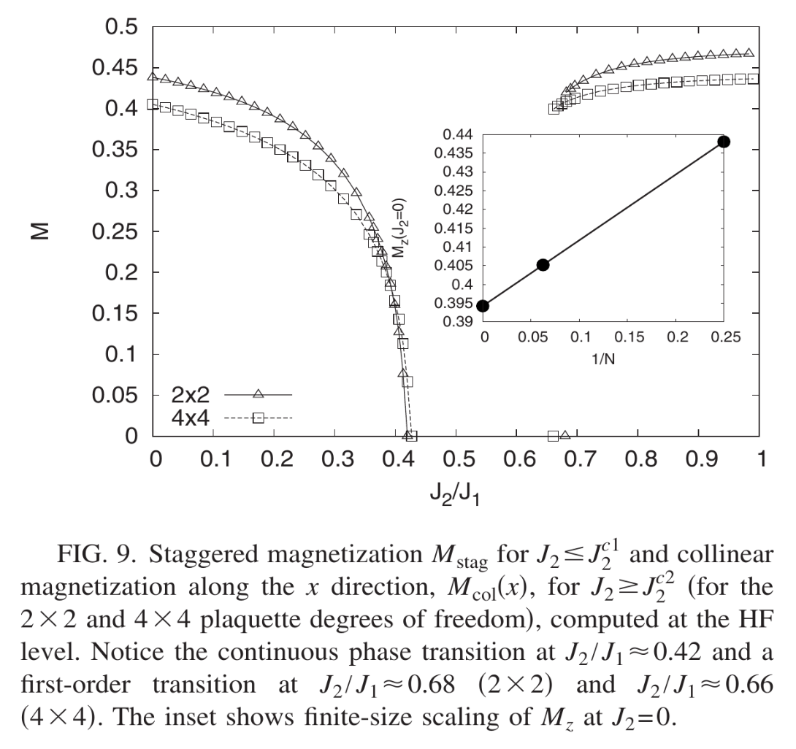

# Question

1. 编写程序：计算正方格点上自旋1/2的反铁磁Heisenberg模型的自旋算符的期望值。将你得到的结果和quantum Monte Carlo 得到的结果进行比较， quantum Monte Carlo的结果需要自行查找。

2. 写出你的详细思路并对程序进行注释。

3. 本题满分10分，注意作业截止时间。

# 理论基础
## Quantum Monte Carlo

This part is the results form an article[^1]——Finite-size scaling of the ground-state parameters of the two-dimensional Heisenberg model, I'll compare my answer with its.

In this article, TABLE &#x2162; gives some parameters of the ground state and FIG 6 givers the ground-energy and the L's relation, just as fellows:

| Parameters              | Value            |
|--------------------------|------------------|
| Ground state energy $E$ | -0.669437(5)    |
| Sublattice magnetization $M$ | 0.3070(3)     |
| Spin stiffness $\rho_s$ | 0.175(2)       |
| Perpendicular susceptibility $\chi_\perp$ | 0.0625(9) |
| Spin-wave velocity $c$ | 1.673(7)      |
| Leading size correction $e_3$ | -2.405(10)   |
| Subleading size correction $e_4$ | 4.00(6)      |
| Size correction $m_1$ | 0.560(6)      |
| Size correction $m_2$ | 1.08(5)      |


磁矩[^3]


But the $M$ this aricle gives is very complex, it's divided into two types:
$$
\begin{aligned}
M^2_1(L) &= 3S(\pi,\pi)/L^2 \\
M^2_1(L) &= M^2 + {\frac{m_1}{L}} + {\frac{m_2}{L^2}} + {\frac{m_3}{L^3}} \\
M^2_2(L) &= 3C(L/2,L/2) \\
M^2_2(L) &= M^2 + {n_1 \over L} + {n_2 \over L^2} + {n_3 \over L^3} \\
\end{aligned}
$$
where has:
$$
\begin{aligned}
| \alpha (p) \rangle &= \prod\limits_{i=1}^p \hat H_{a_i,b_i} |\alpha \rangle , \quad | \alpha (0) \rangle = | \alpha \rangle \\
S^z_i[p] &= \langle \alpha (p) |  S^z_i | \alpha (p) \rangle \\
C(i,j) &= \left \langle{1\over n+1} \sum\limits_{p=0}^n S^z_i[p]S^z_j[p]\right \rangle \\
S(\pi,\pi) &= {1\over N} \sum\limits_{i,j} (-1)^{x_j-x_i+y_j-y_i}C(i,j) \\
\end{aligned}
$$

I can't fully understand these, so I find another definition in NTNU johnof's personal webpage[^2]

> Let us next investigate the amount of magnetic order in the system. Thus we need to identify an order parameter for antiferromagnetic order. Note that the magnetization $M = (1/N)\sum _{i} \left\langle \mathbf{S_{i}} \right\rangle $can not be used since it is zero in the presence of antiferromagnetic order, because the two sublattices give equal-magnitude but opposite-sign contributions to $ M $. Instead the natural order parameter is the so-called sublattice magnetization, defined by averaging $ \left\langle \mathbf{S_{i}} \right\rangle $ only over the sites of one of the two sublattices. Without loss of generality, let’s pick sublattice A, where the putative ordering is in the z direction. The magnitude of the sublattice magnetization is thus :
> $M_{A} = \frac{1}{N_{A}}\sum_{j \in A} \left\langle S_{j}^{z} \right\rangle $

[^1]:Sandvik, Anders W. “Finite-Size Scaling of the Ground-State Parameters of the Two-Dimensional Heisenberg Model.” Physical Review B, vol. 56, no. 18, Nov. 1997, pp. 11678–90. Crossref, https://doi.org/10.1103/physrevb.56.11678.

[^2]:https://folk.ntnu.no/johnof/magnetism-2016.pdf

[^3]:Isaev, Leonid, Gerardo Guzman Ortiz, Jagiellonian University, Bloomington, In, Usa, Instituto de Estructura de la Materia Csic, Madrid and Spain.. “Hierarchical mean-field approach to the J 1 -J 2 Heisenberg model on a square lattice.” Physical Review B 79 (2008): 024409.

## mean-field method
首先，需要明确的是，我们一下的讨论完全是基于自旋为1/2的情况来的；因此，需要明确下述所有具体公式的适用范围。

无论对于哪个粒子，均规定其自旋向上为第一个状态，则有：
$$
S^{x} = \frac{1}{2} \begin{bmatrix} 0 & 1 \\ 1 & 0 \end{bmatrix} \qquad
S^{y} = \frac{1}{2} \begin{bmatrix} 0 & -i \\ i & 0 \end{bmatrix} \qquad
S^{z} = \frac{1}{2} \begin{bmatrix} 1 & 0 \\ 0 & -1 \end{bmatrix} \qquad
$$

下面是平均场近似的主要原理：

以期望值代替外部粒子对元胞的作用，根据对称性，外部粒子自旋的期望就是其对应内部粒子自旋的期望。

自旋的期望用迭代收敛的方式来计算，写出哈密顿量的矩阵表示（这个会在程序设计的时候提到），对角化以求出基态能量和其对应的本征态。开始时以随机数作为期望值，通过迭代得到收敛值。（当然，暂时我还无法证明是否会收敛，只能看计算结果了）。

设最后求出来的本征态为$\ket{ \psi }$，则期望值$ \left\langle S_{i}^{\sigma} \right\rangle = \bra{ \psi } S_{i}^{\sigma} \ket{\psi} $。

至此，思路很明显了，剩下的就是程序的编写了。因为论文涉及的点阵最小是4\*4的，所以我打算写一个能计算n\*n的程序。这在设计上会有一定的困难，但最坑的还是写好了只能算2\*2的，3\*3的可能也能算但比较勉强了。4\*4是根本算不了（在没有优化算法的情况下，在利用对称性的情况下，有可能可以算）;因为我的内存根本无法分配65536\*65536的矩阵。

# 程序编写
# header file
1. a program to print a tensor
   ```
   Function m_cprint(A: ComplexTensor, row_count: Integer,
    column_count: Integer)
    For i from 0 to row_count - 1
        For j from 0 to column_count - 1
            real_part = RealPart(A[(i * column_count) + j])
            imaginary_part = ImaginaryPart(A[(i * column_count) + j])
            Print(real_part, "+", "i", imaginary_part, "  ")
        End For
        Print(newline)  // Print a newline after each row
    End For
    Print(newline)  // Print a newline at the end of the tensor
    End Function
    ```

1. the Kronecher Product (Tensor Product)
   ```
   Function m_KP(A: ComplexMatrix, B: ComplexMatrix, ARows:
    Integer, AColumns: Integer, BRows: Integer, BColumns: Integer,
     C: ComplexMatrix)
    For i from 0 to ARows - 1
        For j from 0 to AColumns - 1
            For k from 0 to BRows - 1
                For l from 0 to BColumns - 1
                    index = ((i * BRows) + k) * (AColumns *
                     BColumns) + ((j * BColumns) + l)
                    C[index] = A[(i * AColumns) + j] * B[(k *
                     BColumns) + l]
                End For
            End For
        End For
    End For
    End Function
    ```

2. get Hamiltonian
   伪代码这里就不给出来了，下面只简要介绍必须的约定。
   我们通过公式$H_{mn} = \bra{m}H\ket{n} $来给出哈密顿量的矩阵。
   我们需要知道两件事——1.状态的规定。2.算符对状态的作用。我们一个一个说。
   首先是状态如何规定。我以0来代表状态$\ket{\uparrow} $（这样是为了与课上的规定相容），以1来代表状态$\ket{\downarrow}$。则对于4个粒子，状态$\ket{0000} = \ket{0}, \ket{1111} = \ket{1*2^{3}+1*2^{2}+1*2^{1}+1*2^{0}} = \ket{15}$（我们用计算机的天然语言来表示，其实也就是二进制）。同样，我们也可以算出给定状态对应的序号。可以以一个数组来存储原生状态，而通过代数式来表达序号。(见APPENDIX)

   下面，我们需要知道各算符对状态的作用。我们有$\hat{S^{+}} \ket{\uparrow} = 0\ket{}, \hat{S^{-}} \ket{\uparrow} = \ket{\downarrow}, \hat{S^{+}} \ket{\downarrow} = \ket{\uparrow}, \hat{S^{-}} \ket{\downarrow} = 0\ket{} $，于是有
   $$
   \begin{aligned}
   \hat{S^{x}} \ket{\uparrow} &= 0.5\ket{\downarrow} & \hat{S^{x}} \ket{\downarrow} &= 0.5\ket{\uparrow} \\
   \hat{S^{y}} \ket{\uparrow} &= 0.5i\ket{\downarrow} & \hat{S^{y}} \ket{\downarrow} &= -0.5i\ket{\uparrow} \\
   \hat{S^{z}} \ket{\uparrow} &= 0.5\ket{\uparrow} & \hat{S^{z}} \ket{\downarrow} &= -0.5\ket{\downarrow} \\
   \end{aligned}
   $$
   用序号表示则是：
   $$
   \begin{aligned}
   \hat{S^{x}} \ket{0} &= 0.5\ket{1} & \hat{S^{x}} \ket{1} &= 0.5\ket{0} \\
   \hat{S^{y}} \ket{0} &= 0.5i\ket{1} & \hat{S^{y}} \ket{1} &= -0.5i\ket{0} \\
   \hat{S^{z}} \ket{0} &= 0.5\ket{0} & \hat{S^{z}} \ket{1} &= -0.5\ket{1} \\
   \end{aligned}
   $$

# main function

首先需要做的就是给出哈密顿量的矩阵表示，这个直接用直乘也是可以的，但是对于较大的矩阵来说运算效率比较低下。同时由于自旋的期望是实数，将不对自旋进行整数化。

采取使用函数的办法来给出哈密顿量，形参应该有：子晶格大小L,自旋的期望值（我将以3\*L\*L的矩阵来存储它）。

如图（以4\*4为例）：

需要分格点内外将耦合的自旋表达出来。我们对内部分行、列；外部分上下左右进行计算。

磁矩用期望值s来表示，有$M^{2} = S^{2}_{x}+S^{2}_{y}+S^{2}_{z} = s^{2} $


# Results
根据下面的结果我们可以看到，能量算的是非常不错的，因为文献中算的是4\*4的，而我的计算机最多只能跑3\*3。但我们可以看到，随子格的尺度增加，能量是减小的。可以预期4\*4的结果会和文献中的差不多。
磁矩的计算结果和文献1中差异较大，但和文献3的2\*2的结果符合的很好。

当L=2时，

1. No.1
   ```
    the initial spin is :
    0.1298+i0.0000  -0.0465+i0.0000  -0.4701+i0.0000  -0.4999+i0.0000  
    -0.4999+i0.0000  -0.1288+i0.0000  0.4523+i0.0000  -0.1297+i0.0000  
    -0.0216+i0.0000  -0.4340+i0.0000  -0.0851+i0.0000  -0.0501+i0.0000  

    the ground eigenvalue is: 
    -0.775951
    the spin is :
    0.0561+i-0.0000  -0.0561+i-0.0000  -0.0561+i0.0000  0.0561+i0.0000  
    -0.3947+i0.0000  0.3947+i-0.0000  0.3947+i-0.0000  -0.3947+i0.0000  
    0.1816+i0.0000  -0.1816+i0.0000  -0.1816+i0.0000  0.1816+i0.0000  

    the magnet moment M is:
    0.4381
    [1] + Done                       "/usr/bin/gdb" --interpreter=mi --tty=${DbgTerm} 0<"/tmp/Microsoft-MIEngine-In-dmwy1kk4.mvh" 1>"/tmp/Microsoft-MIEngine-Out-0wsvlpjn.zic"
   ```
2. No.2
   ```
    the initial spin is :
    -0.4042+i0.0000  -0.4824+i0.0000  -0.0222+i0.0000  0.3943+i0.0000  
    0.0386+i0.0000  -0.2183+i0.0000  0.2899+i0.0000  -0.1397+i0.0000  
    -0.1974+i0.0000  0.2291+i0.0000  -0.3189+i0.0000  -0.1692+i0.0000  

    the ground eigenvalue is: 
    -0.775951
    the spin is :
    0.3599+i-0.0000  -0.3599+i0.0000  -0.3599+i-0.0000  0.3599+i0.0000  
    -0.1292+i-0.0000  0.1292+i-0.0000  0.1292+i0.0000  -0.1292+i0.0000  
    -0.2138+i0.0000  0.2138+i0.0000  0.2138+i0.0000  -0.2138+i0.0000  

    the magnet moment M is:
    0.4381
    [1] + Done                       "/usr/bin/gdb" --interpreter=mi --tty=${DbgTerm} 0<"/tmp/Microsoft-MIEngine-In-ewwfufps.gns" 1>"/tmp/Microsoft-MIEngine-Out-ofh4edul.wvq"
   ```
3. No.3
   ```
    the initial spin is :
    0.3304+i0.0000  -0.4330+i0.0000  -0.2334+i0.0000  0.0043+i0.0000  
    0.0694+i0.0000  -0.3464+i0.0000  0.3289+i0.0000  0.4553+i0.0000  
    0.2850+i0.0000  0.3570+i0.0000  0.1711+i0.0000  -0.3016+i0.0000  

    the ground eigenvalue is: 
    -0.775951
    the spin is :
    0.3459+i0.0000  -0.3459+i-0.0000  -0.3459+i0.0000  0.3459+i0.0000  
    0.1958+i-0.0000  -0.1958+i-0.0000  -0.1958+i0.0000  0.1958+i0.0000  
    -0.1841+i0.0000  0.1841+i0.0000  0.1841+i0.0000  -0.1841+i0.0000  

    the magnet moment M is:
    0.4381
    [1] + Done                       "/usr/bin/gdb" --interpreter=mi --tty=${DbgTerm} 0<"/tmp/Microsoft-MIEngine-In-mo2djqws.igu" 1>"/tmp/Microsoft-MIEngine-Out-icq3wpxd.kcs"
   ```

| Parameters              | Value            |
|--------------------------|------------------|
| Ground state energy $E$ | -0.775951    |
| Sublattice magnetization $M$ | 0.4381     |

当n=3时
1. No.1
   ```
    the initial spin is :
    0.3147+i0.0000  0.2989+i0.0000  0.3544+i0.0000  0.2460+i0.0000  -0.2377+i0.0000  -0.2389+i0.0000  0.1880+i0.0000  0.1120+i0.0000  0.3507+i0.0000  
    -0.0801+i0.0000  0.1747+i0.0000  0.1587+i0.0000  0.1198+i0.0000  0.3082+i0.0000  -0.2695+i0.0000  -0.3548+i0.0000  -0.3002+i0.0000  -0.4938+i0.0000  
    -0.2803+i0.0000  0.2609+i0.0000  0.4644+i0.0000  0.3798+i0.0000  -0.0676+i0.0000  0.4742+i0.0000  -0.4647+i0.0000  0.2401+i0.0000  -0.3010+i0.0000  

    the ground eigenvalue is: 
    -0.732702
    the spin is :
    -0.2614+i-0.0000  0.2440+i-0.0000  -0.2613+i0.0000  0.2440+i-0.0000  -0.2292+i-0.0000  0.2440+i-0.0000  -0.2613+i-0.0000  0.2440+i-0.0000  -0.2614+i0.0000  
    0.1598+i0.0000  -0.1493+i-0.0000  0.1599+i0.0000  -0.1493+i-0.0000  0.1402+i-0.0000  -0.1493+i-0.0000  0.1599+i-0.0000  -0.1493+i0.0000  0.1598+i0.0000  
    0.3129+i0.0000  -0.2922+i0.0000  0.3129+i0.0000  -0.2922+i0.0000  0.2745+i0.0000  -0.2922+i0.0000  0.3129+i0.0000  -0.2922+i0.0000  0.3129+i0.0000  

    the magnet moment M is:
    0.4379
    [1] + Done                       "/usr/bin/gdb" --interpreter=mi --tty=${DbgTerm} 0<"/tmp/Microsoft-MIEngine-In-kwhddnaf.wy3" 1>"/tmp/Microsoft-MIEngine-Out-i4htteaf.w31"
   ```
2. No.2
   ```
    the initial spin is :
    -0.2221+i0.0000  0.1412+i0.0000  -0.2827+i0.0000  0.1383+i0.0000  -0.4496+i0.0000  0.2284+i0.0000  0.1193+i0.0000  0.4661+i0.0000  -0.0115+i0.0000  
    -0.0545+i0.0000  -0.0705+i0.0000  -0.4984+i0.0000  0.3459+i0.0000  0.2450+i0.0000  0.4131+i0.0000  0.3004+i0.0000  -0.0278+i0.0000  -0.4612+i0.0000  
    -0.0332+i0.0000  0.3961+i0.0000  -0.2112+i0.0000  -0.4202+i0.0000  0.1771+i0.0000  0.2681+i0.0000  0.3069+i0.0000  0.1461+i0.0000  -0.4301+i0.0000  

    the ground eigenvalue is: 
    -0.732702
    the spin is :
    -0.2637+i-0.0000  0.2463+i-0.0000  -0.2637+i-0.0000  0.2463+i0.0000  -0.2313+i0.0000  0.2463+i0.0000  -0.2637+i0.0000  0.2463+i-0.0000  -0.2637+i0.0000  
    -0.3134+i-0.0000  0.2926+i-0.0000  -0.3134+i0.0000  0.2926+i-0.0000  -0.2749+i-0.0000  0.2926+i-0.0000  -0.3134+i0.0000  0.2926+i-0.0000  -0.3134+i0.0000  
    -0.1550+i0.0000  0.1447+i0.0000  -0.1550+i0.0000  0.1447+i0.0000  -0.1359+i0.0000  0.1447+i0.0000  -0.1550+i0.0000  0.1447+i0.0000  -0.1550+i0.0000  

    the magnet moment M is:
    0.4379
    [1] + Done                       "/usr/bin/gdb" --interpreter=mi --tty=${DbgTerm} 0<"/tmp/Microsoft-MIEngine-In-4xkinpo3.vqv" 1>"/tmp/Microsoft-MIEngine-Out-s1fw4f0m.s1u"
   ```
3. No.3
   ```
    the initial spin is :
    -0.0906+i0.0000  -0.1538+i0.0000  -0.1131+i0.0000  0.4182+i0.0000  0.1089+i0.0000  -0.2558+i0.0000  -0.3364+i0.0000  0.0390+i0.0000  -0.2926+i0.0000  
    -0.3727+i0.0000  -0.1175+i0.0000  0.2629+i0.0000  0.0821+i0.0000  -0.1040+i0.0000  -0.0026+i0.0000  0.3842+i0.0000  0.3734+i0.0000  0.4178+i0.0000  
    0.0542+i0.0000  -0.3327+i0.0000  -0.0741+i0.0000  -0.4146+i0.0000  0.3858+i0.0000  0.2969+i0.0000  0.4907+i0.0000  0.1481+i0.0000  0.1428+i0.0000  

    the ground eigenvalue is: 
    -0.732702
    the spin is :
    -0.3052+i0.0000  0.2850+i-0.0000  -0.3051+i0.0000  0.2850+i0.0000  -0.2677+i0.0000  0.2850+i0.0000  -0.3051+i0.0000  0.2850+i-0.0000  -0.3052+i0.0000  
    0.1784+i0.0000  -0.1666+i-0.0000  0.1785+i-0.0000  -0.1666+i-0.0000  0.1565+i-0.0000  -0.1666+i0.0000  0.1785+i-0.0000  -0.1666+i0.0000  0.1784+i0.0000  
    0.2584+i0.0000  -0.2413+i0.0000  0.2584+i0.0000  -0.2413+i0.0000  0.2267+i0.0000  -0.2413+i0.0000  0.2584+i0.0000  -0.2413+i0.0000  0.2584+i0.0000  

    the magnet moment M is:
    0.4379
    [1] + Done                       "/usr/bin/gdb" --interpreter=mi --tty=${DbgTerm} 0<"/tmp/Microsoft-MIEngine-In-pacrhaey.jcg" 1>"/tmp/Microsoft-MIEngine-Out-d1433wnx.yxj"
   ```

| Parameters              | Value            |
|--------------------------|------------------|
| Ground state energy $E$ | -0.732702    |
| Sublattice magnetization $M$ | 0.4379     |

# APPENDIX
### the state and it's correxponding number
$\left( \ket{\uparrow}, \ket{\downarrow} \right) \bigotimes \left( \ket{\uparrow}, \ket{\downarrow} \right) $
|                         |                           |                           |                             |
|-------------------------|---------------------------|---------------------------|-----------------------------|
| 00                      | 01                        | 10                        | 11                          |
| $\ket{\uparrow \uparrow}$ | $\ket{\uparrow \downarrow}$ | $\ket{\downarrow \uparrow}$ | $\ket{\downarrow \downarrow}$ |
| 0                       | 1                         | 2                         | 3                           |

$\left( \ket{\uparrow}, \ket{\downarrow} \right) \bigotimes \left( \ket{\uparrow}, \ket{\downarrow} \right) \bigotimes \left( \ket{\uparrow}, \ket{\downarrow} \right) $


|                                    |                                      |                                      |                                        |                                      |                                        |                                        |                                          |
|------------------------------------|--------------------------------------|--------------------------------------|----------------------------------------|--------------------------------------|----------------------------------------|----------------------------------------|------------------------------------------|
| 000                                | 001                                  | 010                                  | 011                                    | 100                                  | 101                                    | 110                                    | 111                                      |
| $\ket{\uparrow \uparrow \uparrow}$ | $\ket{\uparrow \uparrow \downarrow}$ | $\ket{\uparrow \downarrow \uparrow}$ | $\ket{\uparrow \downarrow \downarrow}$ | $\ket{\downarrow \uparrow \uparrow}$ | $\ket{\downarrow \uparrow \downarrow}$ | $\ket{\downarrow \downarrow \uparrow}$ | $\ket{\downarrow \downarrow \downarrow}$ |
| 0                                  | 1                                    | 2                                    | 3                                      | 4                                    | 5                                      | 6                                      | 7                                        |