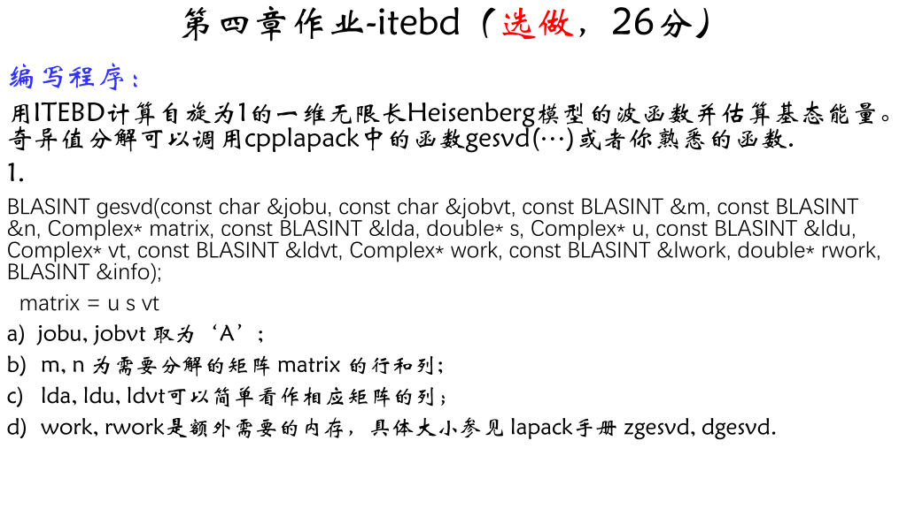
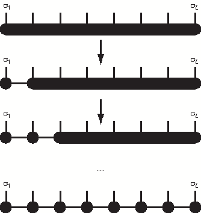
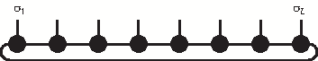
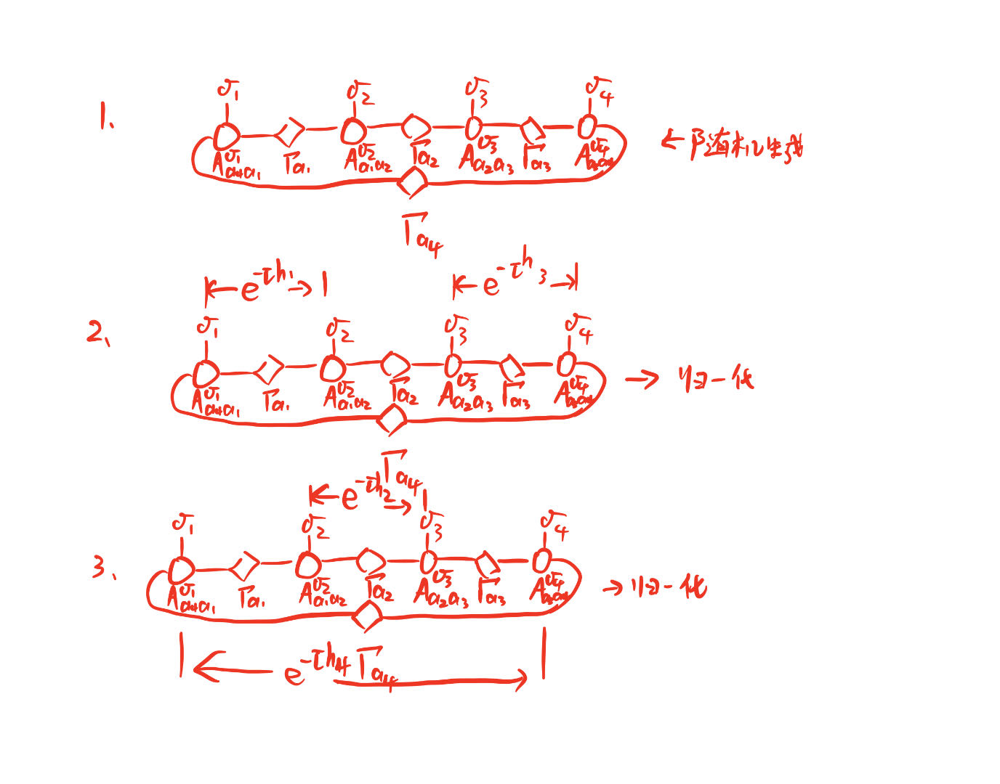
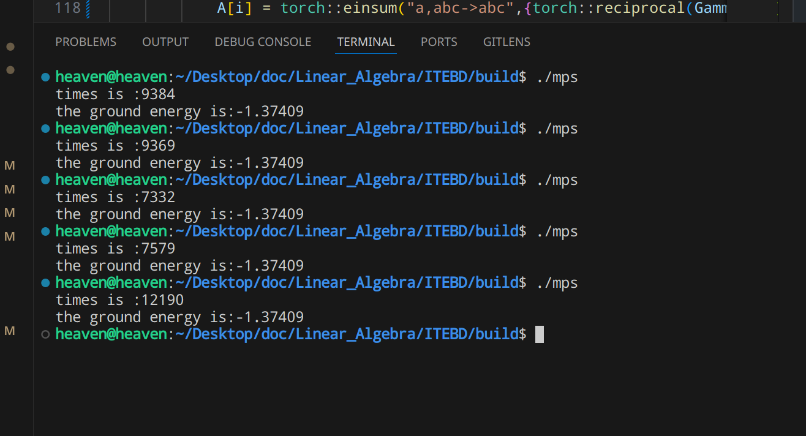

# Question



# 分析

我们先介绍一下“Imaginary Time-evolving Block Decimation”（ITEBD）。

就我理解，这是一种基于“power method”的一种求解矩阵最小本征值（也就是基态）的一种方法。通过“虚时演化+归一化“的方式将系统的状态还原到基态。

下面我们将具体来讲述该算法的基本原理：

### 1. 波函数的含时演化

在薛定谔绘景下，t 系统时刻的状态波函数可以表示为（初始时刻记为时间零点）：
$$
\ket{\Psi_t} = \exp(-i Ht)\ket{\Psi_0}$$
虚时情况下：
$$
\ket{\Psi_\tau} =
\frac{\exp(-H\tau)\ket{\Psi_0}}{\|\exp(-H\tau)\ket{\Psi_0}\|}$$
如果了解“power method”，那么应该可以看出虚时情况下的公式就是我们用来求解矩阵最小本征值的式子。

### 2. Power Method

对于厄米矩阵$H \in \mathbb{C}^{n*n}$，其最大本征值及相应的本征向量可以由下面的推导给出：

设$H$的本征值为$\lambda_{1}, \lambda_{2}, \dots, \lambda_{n}$，对应的本征矢为$\nu_{1}, \nu_{2}, \dots, \nu_{n}$，且$\left\vert \lambda_{1} \right\vert > \left\lvert \lambda_{2} \right\rvert > \dots > \left\lvert \lambda_{n} \right\rvert$。

$\mathbb{C}^{n}$中的向量$\mathbf{x_{0}}$可以写为$\mathbf{x_{0}} = c_{1}\nu_{1} + c_{2}\nu_{2} + \dots + c_{n}\nu_{n}$。（这是由厄米矩阵的本征空间是完备的决定的）

因此，我们有：
$$
\begin{aligned}
\mathbf{x_{1}} = H\mathbf{x_{0}} &= c_{1}\lambda_{1}\nu_{1} + \dots + c_{n}\lambda_{n}\nu_{n} \\
\dots \\
\mathbf{x_{k}} = H^{k}\mathbf{x_{0}} &= c_{1}\lambda_{1}^{k}\nu_{1} + \dots + c_{n}\lambda_{n}^{k}\nu_{n} \\
&= \lambda_{1}^{k}\left[ c_{1}\nu_{1} + c_{2}\left( \frac{\lambda_{2}}{\lambda_{1}} \right)^{k}\nu_{2} + \dots + c_{n}\left( \frac{\lambda_{n}}{\lambda_{1}} \right)^{k}\nu_{n} \right]
\end{aligned}
$$

当$k \rightarrow \infty $时，只会剩下$\nu_{1}$项，但是由于$\lambda_{1}^{k}$会趋向于无穷大或无穷小；因此，每次迭代都需要将$\mathbf{x}$归一化。

上面时一般的“power method”，只能求解绝对值最大的特征值和对应的特征向量。下面我们将介绍求解最小特征值及对应特征向量的方法。

还是上面的矩阵，只不过$\lambda_{1} < \lambda_{2} < \dots < \lambda_{n}$。

则：

$\mathbf{x} = e^{-\beta H}\mathbf{x_{0}} = c_{1}e^{-\beta \lambda_{1}}\nu_{1} + \dots + c_{n}e^{-\beta \lambda_{n}}\nu_{n}$

当$\beta \rightarrow \infty, \mathbf{x} \rightarrow \nu_{1}$。

这就是我们上面给出的虚时演化波函数的式子。实际计算中，一般$\tau \backsim 0.01$，也可能和$\lambda_{1}$相关。

### 3. Matrix Product State

基于奇异值分解我们可以将系统的状态用多个矩阵乘积的形式表示[^1]：

[^1]: Schollwöck, U. (2011). The density-matrix renormalization group in the age of matrix product states. Annals of Physics, 326(1), 96–192. https://doi.org/10.1016/j.aop.2010.09.012 [pdf](article/1008.3477v2.pdf)

> SVD guarantees for an arbitrary (rectangular) matrix \( M \) of dimensions \( (N_A \times N_B) \) the existence of a decomposition:
>
> \[
> M = U S V^\dagger,
> \]
>
> where 
> - \( U \) is of dimension \( (N_A \times \min (N_A,N_B)) \) and has orthonormal columns (the **left singular vectors**), i.e. \( U^\dagger U = I \); if \( N_A \leq N_B \) this implies that it is unitary, and also \( UU^\dagger = I \).
> - \( S \) is of dimension \( (\min (N_A,N_B) \times \min (N_A,N_B)) \), diagonal with non-negative entries \( S_{aa} \equiv s_a \). These are the so-called **singular values**. The number \( r \) of non-zero singular values is the **(Schmidt) rank** of \( M \). In the following, we assume descending order: \( s_1 \geq s_2 \geq \ldots \geq s_r > 0 \).
> - \( V^\dagger \) is of dimension \( (\min (N_A,N_B) \times N_B) \) and has orthonormal rows (the **right singular vectors**), i.e. \( V^\dagger V = I \). If \( N_A \geq N_B \) this implies that it is unitary, and also \( VV^\dagger = I \).

> Consider a lattice of \( L \) sites with \( d \)-dimensional local state spaces \( \{ \sigma_i \} \) on sites \( i=1,\ldots,L \). In fact, while we will be naturally thinking of a one-dimensional lattice, the following also holds for a lattice of arbitrary dimension on which sites have been numbered; however, MPS generated from states on higher-dimensional lattices will not be manageable in numerical practice. The most general pure quantum state on the lattice reads
> 
> \[
> \ket{\psi} = \sum_{\sigma_1,\ldots,\sigma_L} c_{\sigma_1 \ldots \sigma_L} \ket{\sigma_1,\ldots,\sigma_L},
> \]
> 
> where we have exponentially many coefficients \( c_{\sigma_1 \ldots \sigma_L} \) with quite oblique content in typical quantum many-body problems. Let us assume that it is normalized. Can we find a notation that gives a more local notion of the state (while preserving the quantum non-locality of the state)? Indeed, SVD allows us to do just that. The result may look quite forbidding, but will be shown to relate profoundly to familiar concepts of quantum physics. There are three ways of doing this that are of relevance to us.
> 
> **Left-canonical matrix product state.** In a first step, we **reshape** the state vector with \( d^L \) components into a matrix \( \Psi \) of dimension \( (d \times d^{L-1}) \), where the coefficients are related as 
> 
> \[
> \Psi_{\sigma_1, (\sigma_2 \ldots \sigma_L)} = c_{\sigma_1 \ldots \sigma_L}  .
> \]
> 
> An SVD of \( \Psi \) gives
> 
> \[
> c_{\sigma_1 \ldots \sigma_L}  = \Psi_{\sigma_1, (\sigma_2 \ldots \sigma_L)} = \sum_{a_1}^{r_1} U_{\sigma_1,a_1} S_{a_1,a_1} (V^\dagger)_{a_1, (\sigma_2 \ldots \sigma_L)} \equiv \sum_{a_1}^{r_1}  U_{\sigma_1,a_1} c_{a_1\sigma_2\ldots\sigma_L} ,
> \]
> 
> where in the last equality \( S \) and \( V^\dagger \) have been multiplied and the resulting matrix has been reshaped back into a vector. The rank is \( r_1 \leq d \). We now decompose the matrix \( U \) into a collection of \( d \) row vectors \( A^{\sigma_1} \) with entries \( A^{\sigma_1}_{a_1}=U_{\sigma_1,a_1} \). At the same time, we reshape \( c_{a_1\sigma_2\ldots\sigma_L} \) into a matrix \( \Psi_{(a_1\sigma_2),(\sigma_3 \ldots \sigma_L)} \) of dimension \( (r_1 d \times d^{L-2}) \), to give
> 
> \[
> c_{\sigma_1 \ldots \sigma_L}  = \sum_{a_1}^{r_1} A^{\sigma_1}_{a_1} \Psi_{(a_1\sigma_2), (\sigma_3 \ldots \sigma_L)} .
> \]
> 
> \( \Psi \) is subjected to an SVD, and we have 
> 
> \[
> c_{\sigma_1 \ldots \sigma_L}  = \sum_{a_1}^{r_1} \sum_{a_2}^{r_2} A^{\sigma_1}_{a_1} U_{(a_1\sigma_2),a_2} S_{a_2,a_2} (V^\dagger)_{a_2, (\sigma_3 \ldots \sigma_L)} \\
> =\sum_{a_1}^{r_1} \sum_{a_2}^{r_2} A^{\sigma_1}_{a_1} A^{\sigma_2}_{a_1,a_2} \Psi_{(a_2\sigma_3), (\sigma_4 \ldots \sigma_L)} ,
> \]
> 
> where we have replaced \( U \) by a set of \( d \) matrices \( A^{\sigma_2} \) of dimension \( (r_1 \times r_2) \) with entries \( A^{\sigma_2}_{a_1,a_2} = U_{(a_1\sigma_2),a_2} \) and multiplied \( S \) and \( V^\dagger \), to be reshaped into a matrix \( \Psi \) of dimension \( (r_2 d \times d ^{L-3}) \), where \( r_2 \leq r_1 d \leq d^2 \). Upon further SVDs, we obtain
> 
> \[
> c_{\sigma_1 \ldots \sigma_L} = \sum_{a_1, \ldots, a_{L-1}} A^{\sigma_1}_{a_1} A^{\sigma_2}_{a_1,a_2} \ldots A^{\sigma_{L_1}}_{a_{L-2},a_{L-1}} A^{\sigma_{L}}_{a_{L-1}}
> \]
> 
> or more compactly
> 
> \[
> c_{\sigma_1 \ldots \sigma_L} = A^{\sigma_1} A^{\sigma_2} \ldots A^{\sigma_{L-1}} A^{\sigma_L} ,
> \]
> 
> where we have recognized the sums over \( a_1 \), \( a_2 \) and so forth as matrix multiplications. The last set of matrices \( A^{\sigma_L} \) in fact consists of column vectors. If we wish, dummy indices 1 may be introduced in the first and last \( A \) to turn them into matrices, too. In any case, the (arbitrary) quantum state is now represented exactly in the form of a **matrix product state:**
> 
> \[
> \ket{\psi} = \sum_{\sigma_1,\ldots,\sigma_L} A^{\sigma_1} A^{\sigma_2} \ldots A^{\sigma_{L-1}} A^{\sigma_L} \ket{\sigma_1,\ldots,\sigma_L} .
> \]

<figure>
    
    <figcaption>Graphical representation of an iterative construction of an exact MPS representation of an arbitrary quantum state by a sequence of singular value decompositions.</figcaption>
</figure>

上面介绍的是左正则的，还有右正则以及混合正则。但这不是我们本次计算的重点，我们只想要知道系统的状态可以写成矩阵乘积的形式就可以了。

还需要强调的一点是：
> The maximal dimensions of the matrices are reached when for each SVD done the number of non-zero singular values is equal to the upper bound (the lesser of the dimensions of the matrix to be decomposed). Counting reveals that the dimensions may maximally be \((1 \times d)\), \((d \times d^2)\), \(\ldots, (d^{L/2-1} \times d^{L/2})\), \((d^{L/2} \times d^{L/2-1})\), \(\ldots, (d^2 \times d)\), \((d \times 1)\), going from the first to the last site (I have assumed \(L\) even for simplicity here). This shows that in practical calculations it will usually be impossible to carry out this exact decomposition explicitly, as the matrix dimensions blow up exponentially.

**具有周期边界条件的MPS：**

> For periodic boundary conditions, the natural generalization of the MPS form is to make all matrices of equal dimensions \((D \times D)\); as site \(L\) connects back to site \(1\), we make the MPS consistent with matrix multiplications on all bonds by taking the trace (see Figure below):
> 
> \[
> \ket{\psi} = \sum_{\sigma} tr (M^{\sigma_1} \ldots M^     {\sigma_L}) \ket{\sigma} \quad{\rm (MPS \ for \ PBC)}.
> \]
> 
> While *a priori* not more accurate than the other, it is much better suited and computationally far more efficient.

<figure>
    
    <figcaption>Representation of a periodic boundary condition MPS; the long line at the bottom corresponds to the trace operation.</figcaption>
</figure>

### 4. Heisenberg Model


\( \mathcal{h}_{i} = S_{i}^{z}S_{i+1}^{z} + \frac{1}{2}(S_{i}^{+}S_{i+1}^{-} + S_{i}^{-}S_{i+1}^{+}) \)

### 5. 自旋梯子算符

\( \mathbf{S^{\pm }} \ket{j, m} = \sqrt{(j\mp m)(j \pm m +1)} \ket{j,m \pm 1} \)

### 6. 基本步骤



# 代码编写

##### 1.参数

我们首先需要确定参数的个数，为了是我们的程序更加灵活，我们期望其理论上可以计算任意自旋和周期的heisenberg model；因此，参数如下：

- [x] 周期（或者粒子个数）L（本程序仅适用于偶数）
- [x] 粒子的自旋量子数 s
- [x] 矩阵非物理指标的维数 D
- [x] 单位虚时 $\tau$
- [x] 数值零 jz
- [ ] 。。。

##### 2. 自旋算符的矩阵表示

我们需要计算z方向的自旋算符以及两个梯子算符，通过循环的方式完成。虽然他们都是实数域内的，但是考虑到波函数是复的；因此，我们将它们设为复的。

##### 3. $h_{i}$的矩阵表示

\( \mathcal{h}_{i} = S_{i}^{z}S_{i+1}^{z} + \frac{1}{2}(S_{i}^{+}S_{i+1}^{-} + S_{i}^{-}S_{i+1}^{+}) \)

\( \mathbf{S^{\pm }} \ket{j, m} = \sqrt{(j\mp m)(j \pm m +1)} \ket{j,m \pm 1} \)

由于虚时演化算符是$\exp (-\tau h_{i})$，因此，虚时演化算符对应的矩阵可以使用torch::matrix_exp来计算，这是专门用来计算矩阵指数的函数；当然，当$\tau$比较小的时候，也可以用$I-\tau h_{i}$来近似。

采用直乘的算法即可。

##### 4. 生成随机的周期MPS

随机生成上面说的周期MPS的张量即可，注意张量的维度以及物理指标的位置。至于有没有幺正化问题不大，经过一次更新就好了。

当然，这样有极小的可能还没有迭代就截止了；可以打印一下迭代次数来检验。问题不大。

##### 5. 虚时演化

将哈密顿量作用在MPS上并更新奇异值，这里需要注意，我们将用Hilbert子空间进行近似，因此只取前D向最大的；libtorch内置的svd奇异值的排序也正是descending的。

技术细节见代码；我们取偶数个粒子。

##### 6. 改进

计算过程中发现数值稳定性不是很好，可能是$\tau$对于相应的精度来说太大了。

由于改变$\tau$就需要改变相应的哈密顿量对应的矩阵，因此，我们可以适当根据循环次数调整$\tau$的值。

##### 7. 总结

写这个程序还是很不容易的，特别是更新MPS那一块。

主要的步骤是来自文献[^2]的流程图：

<figure>
    
    <figcaption>Fig.update</figcaption>
</figure>

In order to update the MPS after gate $U$ has been applied, see Fig.update, we first contract the tensor network ($i$) into a single tensor $\Theta_{\alpha i j \gamma}$ ($ii$). We then compute the *singular value decomposition* of $\Theta$ according to the index bipartition $[\alpha i]:[j\gamma]$, namely $\Theta = \sum_{\beta} X_{[\alpha i]\beta}\tilde{\lambda}^{A}_\beta Y_{\beta[j \gamma]}$ as in($iii$). We introduce $\lambda^B$ back into the network ($iv$) and form tensors $\tilde{\Gamma}^{A}$ and $\tilde{\Gamma}^{[B]}$ in($iv$) by attaching to $X$ and $Y$ the inverse of the Schmidt coefficients $\lambda^{B}$. All such matrix manipulations are achieved with $O(d^2\chi^2)$ space and $O(d^3\chi^3)$ and need to be performed only once in order to update the MPS for the whole infinite chain.

[^2]: Vidal, G. (2007). Classical Simulation of Infinite-Size Quantum Lattice Systems in One Spatial Dimension. Physical Review Letters, 98(7), 070201. doi:10.1103/physrevlett.98.070201 [pdf](article/0605597v2.pdf)

# 结果

通过改变一下参数，我们可以的到基态能量。（波函数就把MPS乘起来就好，这里就不给出了）

- [x] 周期（或者粒子个数）L（本程序仅适用于偶数）
- [x] 粒子的自旋量子数 s
- [x] 矩阵非物理指标的维数 D
- [x] 单位虚时 $\tau$

算法的数值稳定性是非常不错的；至于与学长给的参考值有细微差别，原因在于对奇异值的归一化的方式上。学长应该是截断后在计算二范数，但我认为时间演化算符作用后的归一化系数应该是一个整体，归一化系数不应该只是截断后的。
把“torch::Tensor E = torch::norm(S,2);”中“S”改为“Gamma[i]”就可以得到和学长一样的结果。两个结果相差不大。

```Cpp
    torch::Tensor E = torch::norm(S,2);
    Gamma[i] = Gamma[i]/E.item<double>();
    Gamma[i] = Gamma[i]/torch::norm(Gamma[i]).item<double>();
    g_E += std::log(E.item<double>())/(-tau);
```



| 周期（或者粒子个数）L（本程序仅适用于偶数） | 4 | 6 | 8 | 4 | 4 | 4 | 4 | 4 | 4 | 4 |
|---|---|---|---|---|---|---|---|---|---|---|
| 粒子的自旋量子数 s | 1.0 | 1.0 | 1.0 | 1.0 | 1.0 | 1.0 | 1.0 | 1.0 | 1.0 | 1.0/2 |
| 矩阵非物理指标的维数 D | 4 | 4 | 4 | 4 | 4 | 6 | 8 | 9 | 10 | 4 |
| 单位虚时 $\tau$ | 0.01 | 0.01 | 0.01 | 0.05 | 0.005 | 0.01 | 0.01 | 0.01 | 0.01 | 0.01 |
| 基态能量 g_E | -1.37409 | -1.37409 | -1.37409 | -1.37676 | -1.37379 | -1.39972 | -1.40112 | -1.40118 | -1.40125 | -0.441079 |