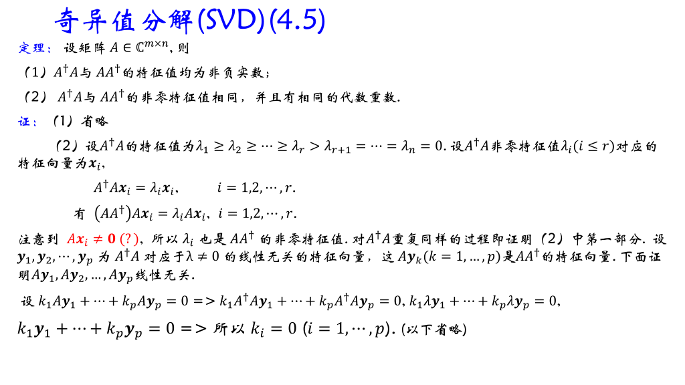
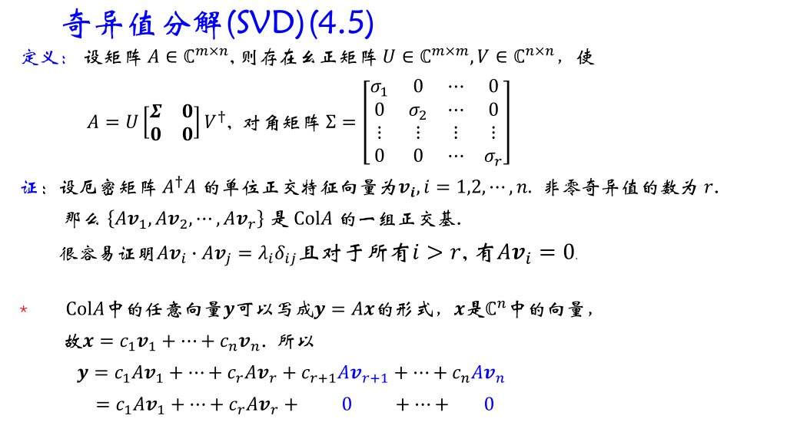
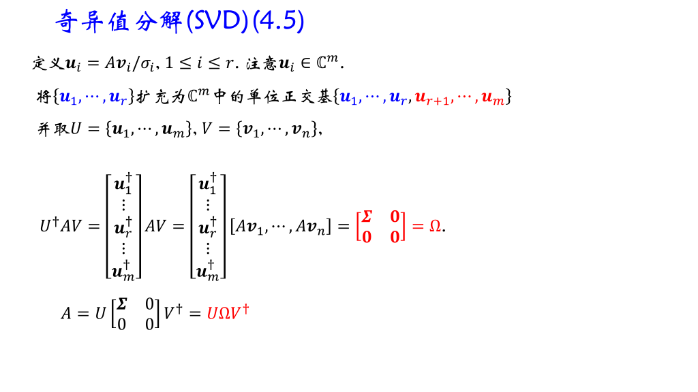
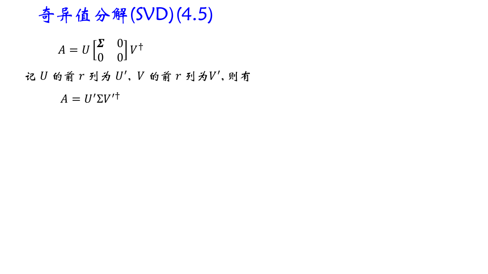
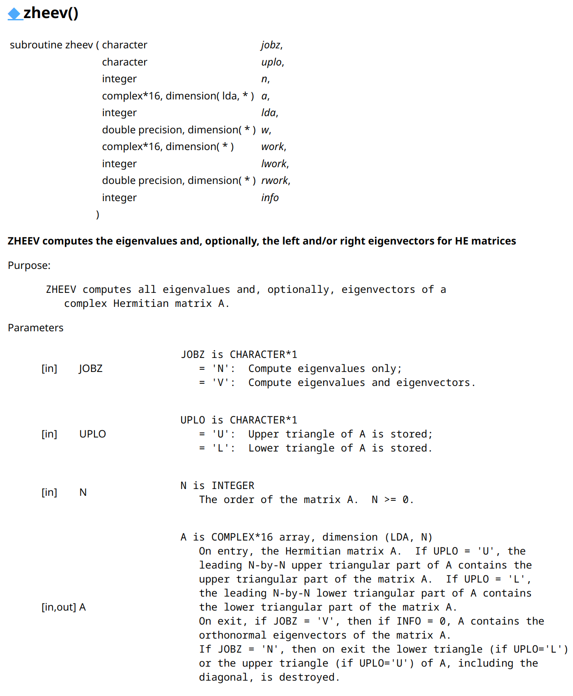
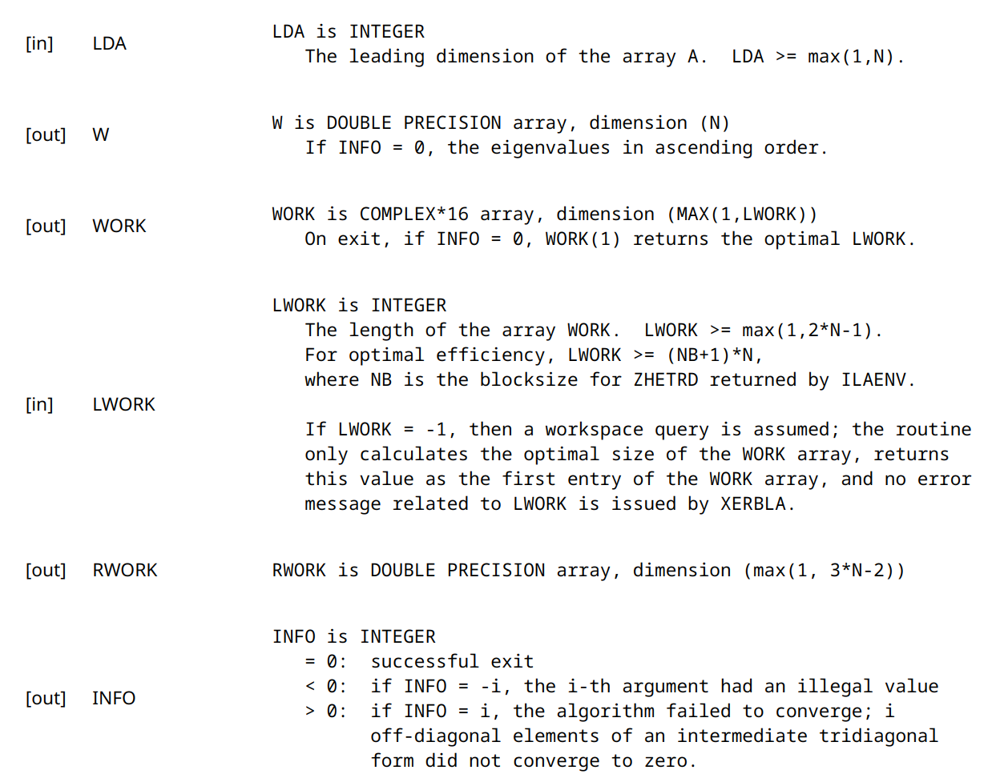
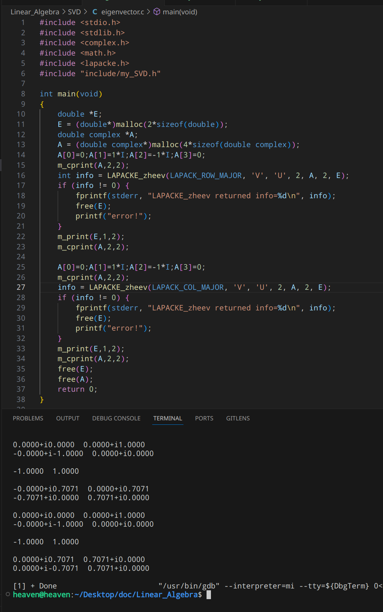
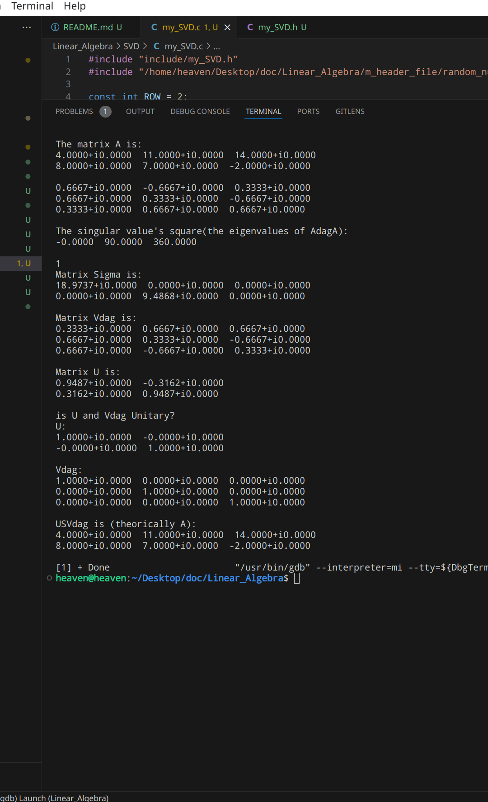
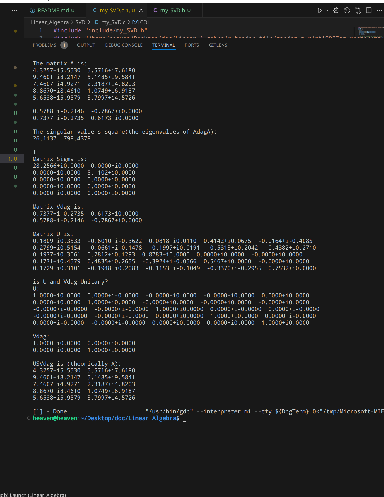
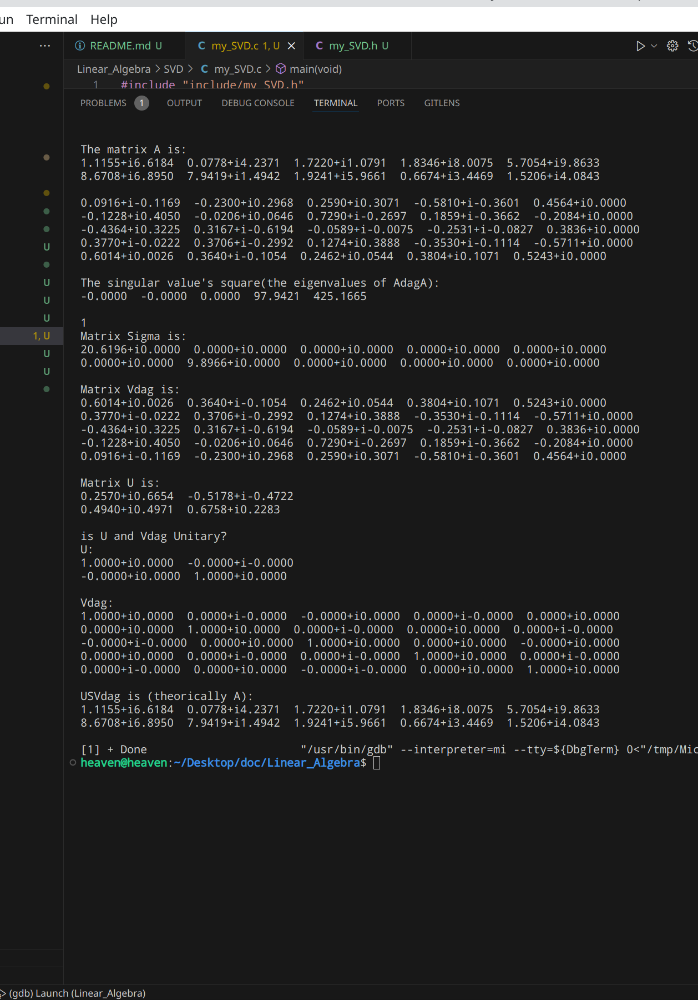

# Question 1
奇异值分解的三条应用：
1. 可用于量子动力学分析，通过奇异值分解，降低Hilbert空间的维数，提取主导自由度，对理解系统的演化有很大帮助。例如[^1]，在二维哈伯德模型的研究中，Singular Value Decomposition被用来分析强相互作用下的量子态。在本目录/article中也有[pdf](/SVD/article/2312.06300v2.pdf)。
2. 可以用于处理量子信息，Carlos Bravo-Prieto等人在文章[^2]中提出了一种量子电路的概念，称为“量子奇异值分解器”(QSVD)。其可以产生二分纯态的奇异值分解。利用其和CNOT构成的电路可以充当原始状态信息的编码器，并存储在其中一方上，将思路反过来就可以用于创建具有精确纠缠结构的随机状态。同时这种电路在量子通信中也有重要应用。在本目录/article中也有[pdf](/SVD/article/PhysRevA.101.062310.pdf)。
3. 在机器学习和深度学习领域，SVD也具有重要作用；例如，在数据压缩领域，可以通过奇异值分解删除矩阵中的冗余，提供一种更紧凑的数据表示形式，著名的JPEG、MP3算法等都使用了奇异值分解。
4. 当然，奇异值分解作为最重要的数值算法之一，其应用十分广泛，比较详细的介绍可见Wikipedia[^3]。在本目录/article中也有[pdf](/SVD/article/Singular_value_decomposition.pdf)。

[^1]: J. Tokimoto, S. Ohmura, A. Takahashi, K. Iwano, H. Okamoto, "New approach to extract important degrees of freedom in quantum dynamics using singular value decomposition: Application to linear optical spectrum in two-dimensional Mott insulators," *arXiv:2312.06300*, 2023. [arXiv: cond-mat.str-el](https://arxiv.org/abs/2312.06300).

[^2]: Carlos Bravo-Prieto, Diego García-Martín, José I. Latorre, "Quantum singular value decomposer," *Phys. Rev. A*, vol. 101, issue 6, pp. 062310, Jun 2020, doi: [10.1103/PhysRevA.101.062310](https://doi.org/10.1103/PhysRevA.101.062310).

[^3]: Wikipedia contributors. (2024, May 2). Singular value decomposition. In Wikipedia, The Free Encyclopedia. Retrieved 05:46, May 5, 2024, from [Wikipeda_Singular_value_decomposition](https://en.wikipedia.org/w/index.php?title=Singular_value_decomposition&oldid=1221850898)

# Question 2
编写矩阵计算任意矩阵的奇异值分解，矩阵的对角化可用cpplapack中的函数heev(...)或者你熟悉的函数。
1. **注意**：heev(...)得到的特征向量是按行排列的，需要转置之后才能当列向量使用。
2. 检验你的程序正确：(a).矩阵分解成立。(b).U,V幺正。(c).奇异值为正。

$\qquad$ 定义：设矩阵$A \in \mathbb{C}^{m \times n} $，$A^{\dag}A $的特征值为$\lambda_{1} \geq \lambda_{2} \geq ... \geq \lambda_{r} > \lambda_{r+1} = ... = \lambda_{n} = 0 $，称$\sigma_{i} = \sqrt{\lambda_{i}}(i = 1,...,r) $为矩阵的奇异值。

$\qquad$SVD分解定理：设矩阵$A \in \mathbb{C}^{m \times n} $，则存在幺正矩阵$U \in \mathbb{C}^{m \times m}, V \in \mathbb{C}^{n \times n} $，使
$A = U\begin{bmatrix} \mathbf{\Sigma} & \mathbf{0} \\ \mathbf{0} & \mathbf{0} \\ \end{bmatrix}V^{\dag}$，对角矩阵$\mathbf{\Sigma} = \begin{bmatrix} \sigma_{1} & 0 & ... & 0 \\ 0 & \sigma_{2} & ... & 0 \\ \vdots & \vdots & \ddots & \vdots \\ 0 & 0 & ... & \sigma_{r} \\ \end{bmatrix}$。

证明课上讲的十分清楚，需要注意的是对引理进行一些说明：
引理：
设矩阵$A \in \mathbb{C}^{m \times n} $，则(a).$A^{\dag}A $与$AA^{\dag} $的特征值均为非负实数；(b).$A^{\dag}A $与$AA^{\dag} $的非零特征值相同，并且具有相同的代数重数。
说明：(a).利用其形式可证明其是半正定矩阵。(b).厄米矩阵可以幺正对角化，因此其特征空间的维数和等于矩阵的维数。

证明过程：

**程序编写：**
同样，按找以前的套路，直接编写函数，在文件中调用即可。

整个程序的编写可以分为一下几块：
1. 求得奇异值及$A^{\dag}A $的特征向量，也就是矩阵V.
   1. 我将使用LAPACK_zheev来进行对角化，其函数原型及简介如下：
    
    
   2. 由于zheev会将得到的特征向量存入传入的矩阵中，因此我们可以将$A^{\dag}A $的值赋给$V^{\dag} $，这样我们让特征向量以行排列，再取复共轭就是最后的结果。（只要将zheev的第一个参数写为LAPACK_COL_MAJOR即可）
   3. 注意各个矩阵的维数一定要对应好，不然会出现奇奇怪怪的错误，我由于Vdag没有定义好，就导致了不管怎么算都只有一个非零特征值的情况&#x1F979;。
   4. 还有一个问题是zheev给出的特征值是按从小到大排列的，我们当然可以按照这个顺序来向下进行，只是矩阵Sigma对角元的上半部分是0。但是为了和定义相一致，我们还是选择将矩阵的列交换一下顺序。
2. 下面需要做的就是将得到的Vdag列交换并给出矩阵Sigma。还有就是奇异值的个数。
   1. 奇异值的个数r比较好整，Vdag也好交换，两个循环的事。
3. 最后我们需要给出U.
   1. 首先是U的前r列，直接带入公式即可。
   2. 后面的通过施密特正交化的方式可以给出。需要注意的是，用以填充的列要与前面的列线性无关。比较好取的是单位向量。这里要判断线性无关比较困难，但选择合适的单位向量并不是难事，可以先随便默认，报错了再调整（概率很小）。
   3. 需要注意的是，LAPACK_zheev计算的不是特征向量，而是特征向量的复共轭，否则结果是不对的，至于这一结论，可以在程序"SVD/eigenvector.c"中看到。
   4. 在写程序的过程中，LAPAVK_zheev有个bug,那就是当参数传入的是**LAPACK_COL_MAJOR**时，虽然特征向量是按行排列的，但是变成了原来的复共轭，从下面的程序可以看出：
   

**Result**
程序完成后，带入了三个进行运算：
1. 课件上的例题，结果稍有不同，但都是对的，也就是说U、v对应向量之间可以同时取相反数。
   
2. 取随机数，m=5,n=2
   
3. 取随机数，m=2,n=5
   