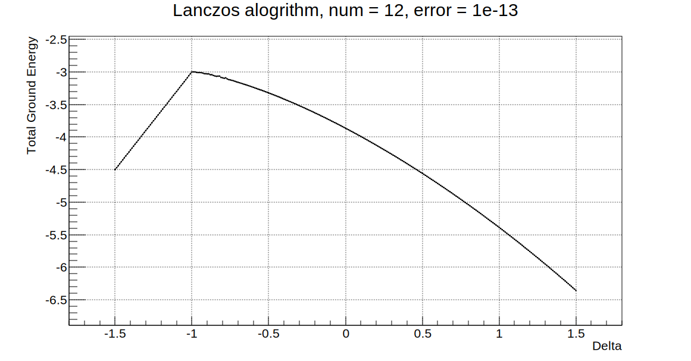
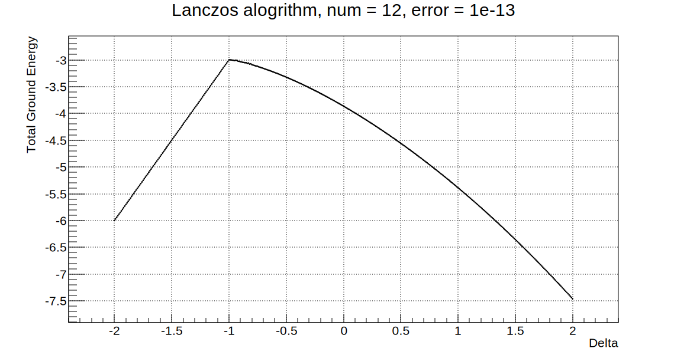
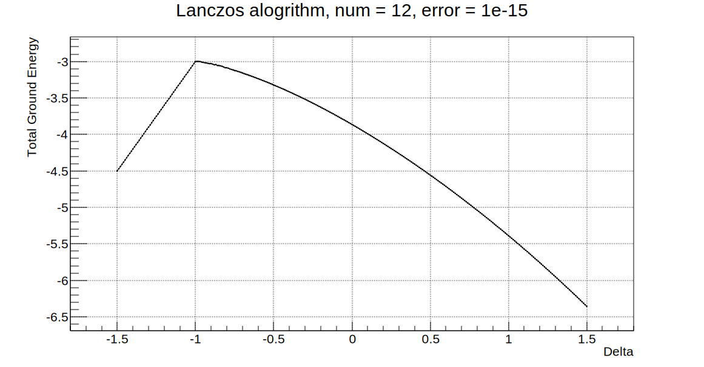
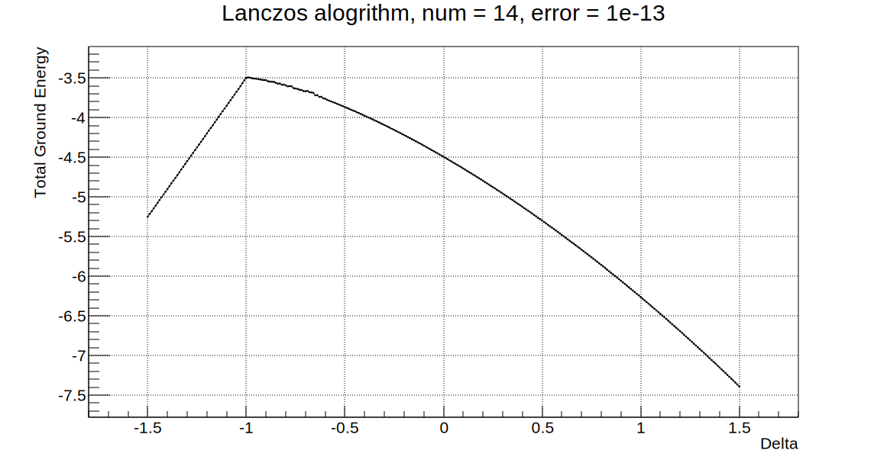

# Question


# 理论分析

#### 1. Krylov subspace

在介绍lanczos算法之前，我们先介绍一下Krylov子空间。它可以说是处理大型矩阵迭代方法，如Arnoldi、lanczos等，的基本原理。

对已知的矩阵A和任意的矢量b，Krylov子空间定义为：

$\mathcal{K}(A,q_{1},k) = span \left\{q_{1}, Aq_{1}, \cdots, A^{k-1} q_{1} \right\} = span \left\{q_{1}, q_{2}, \cdots, q_{k} \right\}$

当然，只有前半部分涉及对Krylov 子空间的定义，后面是该子空间的一组正交完备基；这是我们进行大型矩阵对角化的一般思路。至于为什么这样取Krylov子空间，可以参考*MATRIX COMPUTATIONS*[^1]的第十章。

[^1]: Golub, G. H., and Van Loan, C. F., *Matrix Computations*, 4th ed. (Johns Hopkins University Press, Baltimore, 2013).

#### 2. Lanczos alogrithm

对于厄米矩阵H，和任意给定向量f；我们可以构造 $HF = F\Lambda + rf_{k+1}$，进而可以用F的本征值来估计H的本征值，理论上可以证明，最小和最大本征值是可以很好的估计的。

根据Kroylov子空间的定义，我们可以证明下述引理：

$Hf_{k} = \beta_{k-1} f_{k-1} + \alpha_{k} f_{k} + \beta_{k} f_{k+1} $

Proof:

$$
\begin{aligned}
F_{ij} &= f_{i}^{\dag}Hf_{j} \\
F_{ij}^{*} &=  f_{j}^{\dag}H^{\dag}f_{i} = f_{j}^{\dag}Hf_{i} \\
\end{aligned}
$$
由于$Hf_{j} \in span \left\{f_{1}, f_{2}, \cdots, f_{j+1} \right\}$，因此当$i > j+1 or j > i+1$时，$F_{ij} = 0$。

上面我们直接给出了F矩阵元的表达式，当然只是为了方便起见，下面我们将给出Lanczos算法的构造过程。

Given Hermite matrix H and arbitrary vector f :

$$
f_{1} = f/ \Vert f \Vert_{2} \\
\omega_{1} = Hf_{1} \\
\alpha_{1} = \omega_{1}^{\dag}f_{1} \\
\omega^{\prime}_{1} = \omega_{1} - \alpha_{1}f_{1} \\
\beta_{1} = \Vert \omega^{\prime}_{2} \Vert_{2} \\
f_{2} = \omega^{\prime}_{1}/\beta_{1} \\
\rightarrow Hf_{1} = \alpha_{1}f_{1} + \beta_{1}f_{2}
$$

上面其实就是简单的Gram-Schmit正交化的过程。需要注意的是，由于H是厄米的，因此$\alpha_{1}$一定是一个实数。还有就是$\beta_{1}$的表达式可以转换一下：
$\beta_{1}^{2} = (\omega-\alpha_{1}f_{1})^{\dag}(\omega-\alpha_{1}f_{1}) = (Hf_{1})^{\dag}Hf_{1} - \alpha^{2} = (\alpha_{1}f_{1}+\beta_{1}f_{2})^{\dag}Hf_{1} \Rightarrow \beta_{1} = f_{2}^{\dag}Hf_{1} $。这里我们另$\beta$为实数。

我们再推几个：

$$
\omega_{2} = Hf_{2} \\
\alpha_{2} = \omega_{2}^{\dag}f_{2}, \beta_{1}^{\prime} = f_{1}^{\dag}\omega = f_{1}^{\dag}Hf_{2} \\
\omega^{\prime}_{2} = \omega_{2} - \beta_{1}^{\prime}f_{1} - \alpha_{2}f_2 \\
\beta_{2} = \Vert \omega_{2}^{\prime} \Vert_{2} \\
f_{3} = \omega_{2}^{\prime}/ \beta_{2} \\
\rightarrow Hf_{2} = \beta_{1}^{\prime}f_{1} + \alpha_{2}f_{2} + \beta_{2}f_{3}
$$

注意到$\beta_{1}^{\prime \dag} = \beta_{1} and \beta_{1} \in \mathbb{R}, so \beta_{1}^{\prime} = \beta_{1}$。

剩下的我就不写了，我们最后可以得到：

$HF = F\Lambda + \beta_{k}If_{k+1}^{\intercal} $
其中$F = \begin{bmatrix} f_{1}\quad f_{2}\quad \cdots\quad f_{k} \end{bmatrix}, \Lambda = \begin{bmatrix}\alpha_{1} & \beta_{1} & & \cdots & 0 \\ \beta_{1} & \alpha_{2} & \ddots & & \vdots \\ & \ddots & \ddots & \ddots & \\ \vdots & & \ddots & \ddots & \beta_{k-1} \\0 & \cdots & & \beta_{k-1} & \alpha_{k} \\ \end{bmatrix} $。

设$\mathbf{x}$是$\Lambda$的本征矢，则$HF\mathbf{x} = \lambda F\mathbf{x} + \beta_{k}If_{k+1}^{\intercal}\mathbf{x}$。

#### 3. pseudocode

```
beta0 = (0), q(0) = 0, b = arbitrary, q(1) = b/norm(b)

for n = 1, 2, 3, ...
    v = Aq(n)    //of Aq(n) - beta(n-1)q(n-1) for greater stability
    alpha(n) = \dag{q(n)}*v
    v = v - beta(n-1)q(n-1) - alpha(n)q(n)
    beta(n) = norm(v)
    q(n+1) = v/beta(n)
```

#### 4. spin-1/2 XXY Antiferromagnetism

$H = \sum (S_{i}^{x}S_{i+1}^{x}+S_{i}^{y}S_{i+1}^{y}+\Delta S_{i}^{z}S_{i+1}^{z}) $

在周期性边界条件下，及第一个和最后一个的自旋进行耦合。

# 程序编写

#### 1. function m_Hf

我采用”black box“的形式，不给出哈密顿量对应的矩阵形式，而是直接用位运算flapBit。

这样我们可以节省存储哈密顿量的那个超大空间。但是这只适用于spin-1/2。

自旋1/2的粒子与计算机的二进制正好对应，因此，我们将采用位运算的方式。另外注意到：
$S^{x}\ket{\uparrow} = 1/2\ket{\downarrow},S^{x}\ket{\downarrow} = 1/2\ket{\uparrow};S^{y}\ket{\uparrow} = i/2\ket{\downarrow},S^{y}\ket{\downarrow} = -i/2\ket{\uparrow} $
正好对应于位运算中的翻转运算，因此我们避免使用梯子算符来计算而是直接使用自旋分量算符。

对于海森堡链：
$\sum_{i} (S_{i}^{x}S_{i+1}^{x}+S_{i}^{y}S_{i+1}^{y}+\Delta S_{i}^{z}S_{i+1}^{z}) \ket{\ldots \uparrow_{i}\uparrow_{i+1} \ldots} = \sum_{i} (\Delta/4\ket{\ldots \uparrow_{i}\uparrow_{i+1} \ldots}) $
$\sum_{i} (S_{i}^{x}S_{i+1}^{x}+S_{i}^{y}S_{i+1}^{y}+\Delta S_{i}^{z}S_{i+1}^{z}) \ket{\ldots \downarrow_{i}\downarrow_{i+1} \ldots} = \sum_{i} (\Delta/4\ket{\ldots \downarrow_{i}\downarrow_{i+1} \ldots}) $
$\sum_{i} (S_{i}^{x}S_{i+1}^{x}+S_{i}^{y}S_{i+1}^{y}+\Delta S_{i}^{z}S_{i+1}^{z}) \ket{\ldots \uparrow_{i}\downarrow_{i+1} \ldots} = \sum_{i} (-\Delta/4\ket{\ldots \uparrow_{i}\downarrow_{i+1} \ldots}+1/2\ket{\ldots \downarrow_{i}\uparrow_{i+1} \ldots}) $
$\sum_{i} (S_{i}^{x}S_{i+1}^{x}+S_{i}^{y}S_{i+1}^{y}+\Delta S_{i}^{z}S_{i+1}^{z}) \ket{\ldots \downarrow_{i}\uparrow_{i+1} \ldots} = \sum_{i} (-\Delta/4\ket{\ldots \downarrow_{i}\uparrow_{i+1} \ldots}+1/2\ket{\ldots \uparrow_{i}\downarrow_{i+1} \ldots}) $


#### 2. function m_lanczos

首先，在存储alpha和beta的算法上，我们有两种选择：1. 增加时间复杂度，我们先赋一个较小的空间；在迭代过程中进行判断是否需要扩充。 2. 增加空间复杂度，将alpha、beta的大小就设为Hilbert空间的维数。
我选择后者。

关于f的存储，2个就够了，来回访问。因为我们不算特征向量。

需要注意的是循环结束的条件，这里需要计算三对角矩阵的本征值，最小的那个及对应基态能量的估计值；因此当两次迭代出来的E相差不大时，我们认为其收敛。

当然，这种中间涉及到一些理论，即为什么最小的本征值对应基态能量？在[^1]的书中也有介绍，是有定理保证的。

#### 3. NOTE

最后说一下我在编写时遇到的问题：
1. 在构造哈密顿量作用时，要注意系数的对应，否则会出问题。
2. calloc才是会把变量初始化为零的函数，malloc不是。这个我用了好久都没有问题，这次有问题了，不过是放在循环内部，可能局部变量空间比较小。

# 结果

通过改变参数计算，得出了相变点为$\Delta = -1.0 $的结论。

参数：
1. [x] L 周期内的粒子数  
2. [x] range Delta取值区间
3. [x] error 允许误差
4. [x] num 样本数

**1. L = 12, range = [-1.5,1.5], error = 1e-13, num = 301**


**1. L = 12, range = [-2.0,2.0], error = 1e-13, num = 401**


**1. L = 12, range = [-1.5,1.5], error = 1e-15, num = 301**


**1. L = 14, range = [-1.5,1.5], error = 1e-13, num = 301**


**1. L = 16, range = [-1.5,1.5], error = 1e-13, num = 301**
